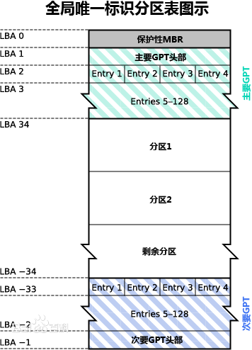

# 硬盘分区

## 概念

磁盘分区是在磁盘上划分几个逻辑部分，用于存储不同性质的文件，使磁盘更好的合理利用。

优点：优化I/O性能、磁盘空间配额限制、多系统安装、隔离系统文件、不同文件系统。

---

### 磁盘、硬盘

磁盘：磁性材料制作（内存是半导体材料），用于外部存储数据的物理存储设备，分为硬盘和软盘。

软盘：优点随取随用，不需要额外的操作，类似独立的存储仓库，但是存储空间相对小，读取速度慢。

硬盘：分为机械硬盘（Hard Disk Drive，HDD）和固态硬盘（SSD）。

- 机械硬盘是磁性存储材料制作属于磁盘，抗震性差，使用寿命相对长一些。

- 固态硬盘采用闪存技术由控制单元和存储单元（FLASH芯片、DRAM芯片）组成，读取速度相对机械硬盘有很大提高，由于固态硬盘内没有机械部件抗震性较高。

注：机械硬盘大小=柱面数(磁道数) × 磁头数(盘面数) × 扇区数 × 扇区大小(512B/4KB)

### 分区表

通常指PC中的主引导记录（MBR）的MBR分区表，但它也可用于泛指将磁盘驱动器划分为分区的其他格式，例如：GUID分区表（GPT）、Apple分区映射（APM）、或BSD磁盘标签。

- Main Boot Record(简称MBR)：MBR历史比较早，兼容性比较好，MBR分区一般用于存储系统文件，创建MBR分区一般用fdisk命令。MBR分区表大小是固定的，最多支持4个主分区或3个主分区+1个扩展分区，单个磁盘分区最大可分配 2 [TiB](https://en.wikipedia.org/wiki/Tebibyte "Tebibyte") ($2^{32}\times512$ bytes).[[2]](https://en.wikipedia.org/wiki/Master_boot_record#cite_note-Microsoft_2013_2581408-2) 基于MBR的分区方案正在被GPT分区方案取代。MBR不能用于非分区存储介质，如 [floppies](https://en.wikipedia.org/wiki/Floppy "Floppy"), [superfloppies](https://en.wikipedia.org/wiki/Superfloppy "Superfloppy") 等。

-  [GUID(Globals Unique Identifiers) Partition Table](https://en.wikipedia.org/wiki/GUID_Partition_Table "GUID Partition Table") (GPT)：由于GPT分区表大小不是固定的，可在GPT分区表头中自定义分区数量的最大值，分区个数、分区大小几乎没有限制，GPT提供了更加灵活的磁盘分区机制，GPT将会成为主流分区。如果操作系统需要安装到GPT分区，须满足主板使用EFI、硬盘使用GPT分区、操作系统支持GPT和EFI。

### 文件系统

- Ext4（ext4日志文件系统、第四代扩展文件系统）文件系统是Linux用途最广泛的日志文件系统。Ext4稳定版本发布于2008年，即Linux 2.6.28版本。支持最大卷（文件系统容量）**1EiB**，最大文件**16TiB**（对于4KiB块）。增加并优化了日志校验和（journal check summing）功能，就是fsck过程更快了。

- XFS是1993年由SiliconGraphic Inc(SGI) 公司创建的高性能的64位文件系统。它通过B+树来索引inode和数据块。XFS可以更高效支持并行IO操作，单卷可达**8EiB**，最大文件也到**8EiB**。

- ZFS真正的下一代文件系统。
