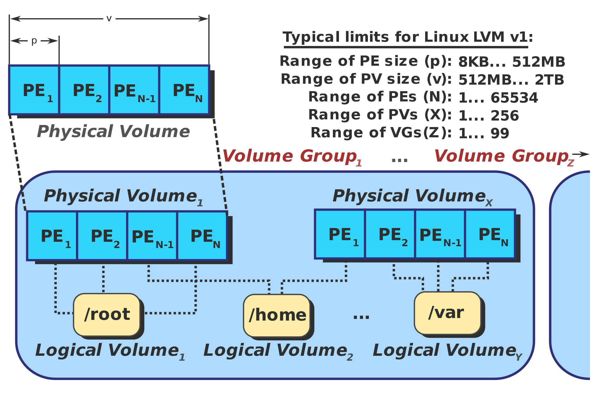

# Logical volume management

In [computer storage](https://en.wikipedia.org/wiki/Computer_storage "Computer storage"), **logical volume management** or **LVM** provides a method of allocating space on [mass-storage](https://en.wikipedia.org/wiki/Mass_storage "Mass storage") devices that is more flexible than conventional [partitioning](https://en.wikipedia.org/wiki/Partition_(computing) "Partition (computing)") schemes to store volumes. In particular, a volume manager can concatenate, [stripe](https://en.wikipedia.org/wiki/Data_striping "Data striping") together or otherwise combine partitions (or [block devices](https://en.wikipedia.org/wiki/Block_device "Block device") in general) into larger virtual partitions that administrators can re-size or move, potentially without interrupting system use.

Volume management represents just one of many forms of [storage virtualization](https://en.wikipedia.org/wiki/Storage_Virtualization "Storage Virtualization"); its implementation takes place in a layer in the [device-driver](https://en.wikipedia.org/wiki/Device_driver "Device driver") stack of an [operating system](https://en.wikipedia.org/wiki/Operating_system "Operating system") (OS) (as opposed to within storage devices or in a network).

## Design

Most volume-manager implementations share the same basic design. They start with **physical volumes** (PVs), which can be either [hard disks](https://en.wikipedia.org/wiki/Hard_disk "Hard disk"), hard disk [partitions](https://en.wikipedia.org/wiki/Partition_(computing) "Partition (computing)"), or [Logical Unit Numbers (LUNs)](https://en.wikipedia.org/wiki/Logical_Unit_Number "Logical Unit Number") of an external storage device. Volume management treats each PV as being composed of a sequence of chunks called **physical extents** (PEs). Some volume managers (such as that in HP-UX and Linux) have PEs of a uniform size; others (such as that in [Veritas](https://en.wikipedia.org/wiki/VERITAS_Volume_Manager "VERITAS Volume Manager")) have variably-sized PEs that can be split and merged at will.

Normally, PEs simply map one-to-one to **logical extents** (LEs). With mirroring, multiple PEs map to each LE. These PEs are drawn from a **physical volume group** (PVG), a set of same-sized PVs which act similarly to hard disks in a RAID1 array. PVGs are usually laid out so that they reside on different [disks](https://en.wikipedia.org/wiki/Hard_disk "Hard disk") or [data buses](https://en.wikipedia.org/wiki/Computer_bus "Computer bus") for maximum redundancy.

The system pools LEs into a *volume group* (VG). The pooled LEs can then be concatenated together into virtual disk partitions called **logical volumes** or [LVs](https://en.wikipedia.org/wiki/Logical_volume "Logical volume"). Systems can use LVs as raw [block devices](https://en.wikipedia.org/wiki/Block_device "Block device") just like disk partitions: creating mountable [file systems](https://en.wikipedia.org/wiki/File_system "File system") on them, or using them as [swap](https://en.wikipedia.org/wiki/Virtual_memory "Virtual memory") storage.

Striped LVs allocate each successive LE from a different PV; depending on the size of the LE, this can improve performance on large sequential reads by bringing to bear the combined read-throughput of multiple PVs.

Administrators can grow LVs (by concatenating more LEs) or shrink them (by returning LEs to the pool). The concatenated LEs do not have to be contiguous. This allows LVs to grow without having to move already-allocated LEs. Some volume managers allow the re-sizing of LVs in either direction while online. Changing the size of the LV does not necessarily change the size of a file system on it; it merely changes the size of its containing space. A file system that can be resized online is recommended in that it allows the system to adjust its storage on-the-fly without interrupting applications.

PVs and LVs cannot be shared between or span different VGs (although some volume managers may allow moving them at will between VGs on the same host). This allows administrators conveniently to bring VGs online, to take them offline or to move them between host systems as a single administrative unit.

VGs can grow their storage pool by absorbing new PVs or shrink by retracting from PVs. This may involve moving already-allocated LEs out of the PV. Most volume managers can perform this movement online; if the underlying hardware is hot-pluggable this allows engineers to upgrade or replace storage without system downtime.

## Concepts

### Hybrid volume[[edit](https://en.wikipedia.org/w/index.php?title=Logical_volume_management&action=edit&section=3 "Edit section: Hybrid volume")]

A [hybrid volume](https://en.wikipedia.org/wiki/Hybrid_volume "Hybrid volume") is any volume that intentionally and opaquely makes use of two separate physical volumes. For instance, a workload may consist of random seeks so an SSD may be used to permanently store frequently used or recently written data, while using higher-capacity rotational magnetic media for long-term storage of rarely needed data. On Linux, [bcache](https://en.wikipedia.org/wiki/Bcache "Bcache") or [dm-cache](https://en.wikipedia.org/wiki/Dm-cache "Dm-cache") may be used for this purpose, while [Fusion Drive](https://en.wikipedia.org/wiki/Fusion_Drive "Fusion Drive") may be used on OS X. [ZFS](https://en.wikipedia.org/wiki/ZFS "ZFS") also implements this functionality at the [file system](https://en.wikipedia.org/wiki/File_system "File system") level, by allowing administrators to configure multi-level read/write caching.

Hybrid volumes present a similar concept as [hybrid drives](https://en.wikipedia.org/wiki/Hybrid_drive "Hybrid drive"), which also combine solid-state storage and rotational magnetic media.

### Snapshots[[edit](https://en.wikipedia.org/w/index.php?title=Logical_volume_management&action=edit&section=4 "Edit section: Snapshots")]

Some volume managers also implement [snapshots](https://en.wikipedia.org/wiki/Snapshot_(computer_storage) "Snapshot (computer storage)") by applying [copy-on-write](https://en.wikipedia.org/wiki/Copy-on-write "Copy-on-write") to each LE. In this scheme, the volume manager will copy the LE to a *copy-on-write table* just before it is written to. This preserves an old version of the LV, the snapshot, which may be later reconstructed by overlaying the copy-on-write table atop the current LV. Unless the volume management supports both thin provisioning and discard, once an LE in the origin volume is written to, it is permanently stored in the snapshot volume. If the snapshot volume was made smaller than its origin, which is a common practice, this may render the snapshot inoperable.

Snapshots can be useful for backing up self-consistent versions of volatile data such as table files from a busy database, or for rolling back large changes (such as an operating system upgrade) in a single operation. Snapshots have a similar effect as rendering storage [quiescent](https://en.wikipedia.org/wiki/Quiesce "Quiesce"), and are similar to the [shadow copy](https://en.wikipedia.org/wiki/Shadow_copy "Shadow copy") (VSS) service in Microsoft Windows.

Some Linux-based [Live CDs](https://en.wikipedia.org/wiki/Live_CD "Live CD") also use snapshots to simulate read-write access to a read-only [optical disc](https://en.wikipedia.org/wiki/Optical_disc "Optical disc").

## Implementations

| Vendor                                                                                                                                                  | Introduced in                                                                                                  | Volume manager                                                                                                                                                                                                                                                                          | Allocate anywhere[[a]](https://en.wikipedia.org/wiki/Logical_volume_management#cite_note-1) | Snapshots                                                                      | [RAID 0](https://en.wikipedia.org/wiki/RAID_0 "RAID 0")                                | [RAID 1](https://en.wikipedia.org/wiki/RAID_1 "RAID 1")                                | [RAID 5](https://en.wikipedia.org/wiki/RAID_5 "RAID 5")                                | [RAID 10](https://en.wikipedia.org/wiki/RAID_10 "RAID 10")                             | [Thin provisioning](https://en.wikipedia.org/wiki/Thin_provisioning "Thin provisioning") | Notes                                                                                                                                                                                                                                                                                                                                                                                                                                                                                                                                                                                                                                                                                                                                                                                                                                                                                       |
| ------------------------------------------------------------------------------------------------------------------------------------------------------- | -------------------------------------------------------------------------------------------------------------- | --------------------------------------------------------------------------------------------------------------------------------------------------------------------------------------------------------------------------------------------------------------------------------------- | ------------------------------------------------------------------------------------------- | ------------------------------------------------------------------------------ | -------------------------------------------------------------------------------------- | -------------------------------------------------------------------------------------- | -------------------------------------------------------------------------------------- | -------------------------------------------------------------------------------------- | ---------------------------------------------------------------------------------------- | ------------------------------------------------------------------------------------------------------------------------------------------------------------------------------------------------------------------------------------------------------------------------------------------------------------------------------------------------------------------------------------------------------------------------------------------------------------------------------------------------------------------------------------------------------------------------------------------------------------------------------------------------------------------------------------------------------------------------------------------------------------------------------------------------------------------------------------------------------------------------------------------- |
| [IBM](https://en.wikipedia.org/wiki/IBM "IBM")                                                                                                          | [AIX](https://en.wikipedia.org/wiki/AIX_operating_system "AIX operating system") 3.0 (1989)                    | [Logical Volume Manager](https://en.wikipedia.org/w/index.php?title=Logical_Volume_Manager_(AIX)&action=edit&redlink=1 "Logical Volume Manager (AIX) (page does not exist)")                                                                                                            | Yes                                                                                         | Yes[[b]](https://en.wikipedia.org/wiki/Logical_volume_management#cite_note-2)  | Yes                                                                                    | Yes                                                                                    | No                                                                                     | Yes[[c]](https://en.wikipedia.org/wiki/Logical_volume_management#cite_note-3)          |                                                                                          | Refers to PEs as PPs (physical partitions), and to LEs as LPs (logical partitions). Does not have a copy-on-write snapshot mechanism; creates snapshots by freezing one volume of a mirror pair.                                                                                                                                                                                                                                                                                                                                                                                                                                                                                                                                                                                                                                                                                            |
| [Hewlett-Packard](https://en.wikipedia.org/wiki/Hewlett-Packard "Hewlett-Packard")                                                                      | [HP-UX](https://en.wikipedia.org/wiki/HP-UX "HP-UX") 9.0                                                       | HP Logical Volume Manager                                                                                                                                                                                                                                                               | Yes                                                                                         | Yes                                                                            | Yes                                                                                    | Yes                                                                                    | No                                                                                     | Yes                                                                                    |                                                                                          |                                                                                                                                                                                                                                                                                                                                                                                                                                                                                                                                                                                                                                                                                                                                                                                                                                                                                             |
|                                                                                                                                                         | [FreeBSD](https://en.wikipedia.org/wiki/FreeBSD "FreeBSD")                                                     | [Vinum Volume Manager](https://en.wikipedia.org/wiki/Vinum_volume_manager "Vinum volume manager")                                                                                                                                                                                       | Yes                                                                                         | Yes[[d]](https://en.wikipedia.org/wiki/Logical_volume_management#cite_note-4)  | Yes                                                                                    | Yes                                                                                    | Yes                                                                                    | Yes                                                                                    |                                                                                          | The FreeBSD fast file system (UFS) supports snapshots.                                                                                                                                                                                                                                                                                                                                                                                                                                                                                                                                                                                                                                                                                                                                                                                                                                      |
|                                                                                                                                                         | [FreeBSD](https://en.wikipedia.org/wiki/FreeBSD "FreeBSD")                                                     | [ZFS](https://en.wikipedia.org/wiki/ZFS "ZFS")                                                                                                                                                                                                                                          | Yes                                                                                         | Yes                                                                            | Yes                                                                                    | Yes                                                                                    | Yes                                                                                    | Yes                                                                                    | Yes                                                                                      | A file system with integrated volume management                                                                                                                                                                                                                                                                                                                                                                                                                                                                                                                                                                                                                                                                                                                                                                                                                                             |
|                                                                                                                                                         | [NetBSD](https://en.wikipedia.org/wiki/NetBSD "NetBSD")                                                        | [Logical Volume Manager](https://en.wikipedia.org/w/index.php?title=Logical_volume_manager_(BSD)&action=edit&redlink=1 "Logical volume manager (BSD) (page does not exist)")                                                                                                            | Yes                                                                                         | No                                                                             | Yes                                                                                    | Yes                                                                                    | No                                                                                     | No                                                                                     |                                                                                          | NetBSD from version 6.0 supports its own re-implementation of Linux LVM. Re-implementation is based on a BSD licensed device-mapper driver and uses a port of Linux lvm tools as the userspace part of LVM. There is no need to support RAID5 in LVM because of NetBSD superior RAIDFrame subsystem.                                                                                                                                                                                                                                                                                                                                                                                                                                                                                                                                                                                        |
|                                                                                                                                                         | [NetBSD](https://en.wikipedia.org/wiki/NetBSD "NetBSD")                                                        | [ZFS](https://en.wikipedia.org/wiki/ZFS "ZFS")                                                                                                                                                                                                                                          | Yes                                                                                         | Yes                                                                            | Yes                                                                                    | Yes                                                                                    | Yes                                                                                    | Yes                                                                                    | Yes                                                                                      | A file system with integrated volume management                                                                                                                                                                                                                                                                                                                                                                                                                                                                                                                                                                                                                                                                                                                                                                                                                                             |
| The NetBSD Foundation, Inc.                                                                                                                             | [NetBSD § 5.0](https://en.wikipedia.org/wiki/NetBSD#5.0 "NetBSD") (2009)                                       | [bioctl](https://en.wikipedia.org/wiki/Bioctl "Bioctl") [arcmsr](https://en.wikipedia.org/w/index.php?title=Areca_(company)&action=edit&redlink=1 "Areca (company) (page does not exist)")[[1]](https://en.wikipedia.org/wiki/Logical_volume_management#cite_note-netbsd%C2%A7arcmsr-5) | No                                                                                          | No                                                                             | Yes[[2]](https://en.wikipedia.org/wiki/Logical_volume_management#cite_note-arcmsr.c-6) | Yes[[2]](https://en.wikipedia.org/wiki/Logical_volume_management#cite_note-arcmsr.c-6) | Yes[[2]](https://en.wikipedia.org/wiki/Logical_volume_management#cite_note-arcmsr.c-6) | Yes[[2]](https://en.wikipedia.org/wiki/Logical_volume_management#cite_note-arcmsr.c-6) |                                                                                          | [bioctl](https://en.wikipedia.org/wiki/Bioctl "Bioctl") on NetBSD can be used for both maintenance and initialisation of hardware RAID, although initialisation (through `BIOCVOLOPS` [ioctl](https://en.wikipedia.org/wiki/Ioctl "Ioctl")) is only supported by a single driver as of 2019 — `arcmsr(4)`[[1]](https://en.wikipedia.org/wiki/Logical_volume_management#cite_note-netbsd%C2%A7arcmsr-5)[[2]](https://en.wikipedia.org/wiki/Logical_volume_management#cite_note-arcmsr.c-6); software RAID is supported separately through [RAIDframe](https://en.wikipedia.org/w/index.php?title=RAIDframe&action=edit&redlink=1 "RAIDframe (page does not exist)")[[3]](https://en.wikipedia.org/wiki/Logical_volume_management#cite_note-RAIDframe-7)[[4]](https://en.wikipedia.org/wiki/Logical_volume_management#cite_note-raidctl-8) and [ZFS](https://en.wikipedia.org/wiki/ZFS "ZFS") |
| The OpenBSD Project                                                                                                                                     | [OpenBSD 4.2](https://en.wikipedia.org/wiki/OpenBSD_version_history#4.2 "OpenBSD version history") (2007)      | [bioctl](https://en.wikipedia.org/wiki/Bioctl "Bioctl") softraid[[5]](https://en.wikipedia.org/wiki/Logical_volume_management#cite_note-openbsd%C2%A7softraid-9)                                                                                                                        | Yes                                                                                         | No                                                                             | Yes                                                                                    | Yes                                                                                    | Yes                                                                                    | Yes                                                                                    |                                                                                          | [bioctl](https://en.wikipedia.org/wiki/Bioctl "Bioctl") on OpenBSD can be used for maintenance of hardware RAID, as well as for both initialisation and maintenance of software RAID                                                                                                                                                                                                                                                                                                                                                                                                                                                                                                                                                                                                                                                                                                        |
|                                                                                                                                                         | [Linux](https://en.wikipedia.org/wiki/Linux "Linux") 2.2                                                       | [Logical Volume Manager version 1](https://en.wikipedia.org/wiki/Logical_Volume_Manager_(Linux) "Logical Volume Manager (Linux)")                                                                                                                                                       | Yes                                                                                         | Yes                                                                            | Yes                                                                                    | Yes                                                                                    | No                                                                                     |                                                                                        | No                                                                                       |                                                                                                                                                                                                                                                                                                                                                                                                                                                                                                                                                                                                                                                                                                                                                                                                                                                                                             |
|                                                                                                                                                         | [Linux](https://en.wikipedia.org/wiki/Linux "Linux") 2.4                                                       | [Enterprise Volume Management System](https://en.wikipedia.org/wiki/Enterprise_Volume_Management_System "Enterprise Volume Management System")                                                                                                                                          | Yes                                                                                         | Yes                                                                            | Yes                                                                                    | Yes                                                                                    | Yes                                                                                    |                                                                                        | No                                                                                       |                                                                                                                                                                                                                                                                                                                                                                                                                                                                                                                                                                                                                                                                                                                                                                                                                                                                                             |
|                                                                                                                                                         | [Linux](https://en.wikipedia.org/wiki/Linux "Linux") 2.6 and above                                             | [Logical Volume Manager version 2](https://en.wikipedia.org/wiki/Logical_Volume_Manager_(Linux) "Logical Volume Manager (Linux)")                                                                                                                                                       | Yes                                                                                         | Yes                                                                            | Yes                                                                                    | Yes                                                                                    | Yes                                                                                    | Yes                                                                                    | Yes                                                                                      |                                                                                                                                                                                                                                                                                                                                                                                                                                                                                                                                                                                                                                                                                                                                                                                                                                                                                             |
|                                                                                                                                                         | [Linux](https://en.wikipedia.org/wiki/Linux "Linux") 2.6 and above                                             | [Btrfs](https://en.wikipedia.org/wiki/Btrfs "Btrfs")                                                                                                                                                                                                                                    | Yes                                                                                         | Yes                                                                            | Yes                                                                                    | Yes                                                                                    | Yes (not stable)                                                                       | Yes                                                                                    | —                                                                                        | A file system with integrated volume management                                                                                                                                                                                                                                                                                                                                                                                                                                                                                                                                                                                                                                                                                                                                                                                                                                             |
| [Silicon Graphics](https://en.wikipedia.org/wiki/Silicon_Graphics "Silicon Graphics")                                                                   | [IRIX](https://en.wikipedia.org/wiki/IRIX "IRIX") or [Linux](https://en.wikipedia.org/wiki/Linux "Linux")      | [XVM Volume Manager](https://en.wikipedia.org/w/index.php?title=XVM_Volume_Manager&action=edit&redlink=1 "XVM Volume Manager (page does not exist)")                                                                                                                                    | Yes                                                                                         | Yes                                                                            | Yes                                                                                    | Yes                                                                                    | Yes                                                                                    |                                                                                        |                                                                                          |                                                                                                                                                                                                                                                                                                                                                                                                                                                                                                                                                                                                                                                                                                                                                                                                                                                                                             |
| [Sun Microsystems](https://en.wikipedia.org/wiki/Sun_Microsystems "Sun Microsystems")                                                                   | [SunOS](https://en.wikipedia.org/wiki/SunOS "SunOS")                                                           | [Solaris Volume Manager](https://en.wikipedia.org/wiki/Solaris_Volume_Manager "Solaris Volume Manager") (was [Solstice DiskSuite](https://en.wikipedia.org/wiki/Solstice_DiskSuite "Solstice DiskSuite")).                                                                              | No                                                                                          | No                                                                             | Yes                                                                                    | Yes                                                                                    | Yes                                                                                    | Yes                                                                                    |                                                                                          | Refers to PVs as volumes (which can be combined with RAID0, RAID1 or RAID5 primitives into larger volumes), to LVs as soft partitions (which are contiguous extents placeable anywhere on volumes, but which cannot span multiple volumes), and to VGs as disk sets.                                                                                                                                                                                                                                                                                                                                                                                                                                                                                                                                                                                                                        |
| [Sun Microsystems](https://en.wikipedia.org/wiki/Sun_Microsystems "Sun Microsystems")                                                                   | [Solaris 10](https://en.wikipedia.org/wiki/Solaris_10 "Solaris 10")                                            | [ZFS](https://en.wikipedia.org/wiki/ZFS "ZFS")                                                                                                                                                                                                                                          | Yes                                                                                         | Yes                                                                            | Yes                                                                                    | Yes                                                                                    | Yes                                                                                    | Yes                                                                                    | Yes                                                                                      | A file system with integrated volume management                                                                                                                                                                                                                                                                                                                                                                                                                                                                                                                                                                                                                                                                                                                                                                                                                                             |
|                                                                                                                                                         | [illumos](https://en.wikipedia.org/wiki/Illumos "Illumos")                                                     | [ZFS](https://en.wikipedia.org/wiki/ZFS "ZFS")                                                                                                                                                                                                                                          | Yes                                                                                         | Yes                                                                            | Yes                                                                                    | Yes                                                                                    | Yes                                                                                    | Yes                                                                                    | Yes                                                                                      | A file system with integrated volume management                                                                                                                                                                                                                                                                                                                                                                                                                                                                                                                                                                                                                                                                                                                                                                                                                                             |
| [Veritas](https://en.wikipedia.org/wiki/Veritas_Software "Veritas Software")[[e]](https://en.wikipedia.org/wiki/Logical_volume_management#cite_note-10) | Cross-OS                                                                                                       | [Veritas Volume Manager](https://en.wikipedia.org/wiki/Veritas_Volume_Manager "Veritas Volume Manager") (VxVM)                                                                                                                                                                          | Yes                                                                                         | Yes                                                                            | Yes                                                                                    | Yes                                                                                    | Yes                                                                                    | Yes                                                                                    |                                                                                          | Refers to LVs as *volumes*, to VGs as *disk groups*; has variably-sized PEs called *subdisks* and LEs called *plexes*.                                                                                                                                                                                                                                                                                                                                                                                                                                                                                                                                                                                                                                                                                                                                                                      |
| [Microsoft](https://en.wikipedia.org/wiki/Microsoft "Microsoft")                                                                                        | [Windows 2000](https://en.wikipedia.org/wiki/Windows_2000 "Windows 2000") and later NT-based operating systems | [Logical Disk Manager](https://en.wikipedia.org/wiki/Logical_Disk_Manager "Logical Disk Manager")                                                                                                                                                                                       | Yes                                                                                         | Yes[[f]](https://en.wikipedia.org/wiki/Logical_volume_management#cite_note-11) | Yes                                                                                    | Yes                                                                                    | Yes                                                                                    | No                                                                                     | No                                                                                       | Does not have a concept of PEs or LEs; can only RAID0, RAID1, RAID5 or concatenate disk partitions into larger volumes; file systems must span whole volumes.                                                                                                                                                                                                                                                                                                                                                                                                                                                                                                                                                                                                                                                                                                                               |
|                                                                                                                                                         | [Windows 8](https://en.wikipedia.org/wiki/Windows_8 "Windows 8")                                               | [Storage Spaces](https://en.wikipedia.org/wiki/Features_new_to_Windows_8#Storage_Spaces "Features new to Windows 8")[[6]](https://en.wikipedia.org/wiki/Logical_volume_management#cite_note-12)                                                                                         | Yes                                                                                         | Yes                                                                            | No                                                                                     | Yes                                                                                    | Yes                                                                                    | No                                                                                     | Yes                                                                                      | Higher-level logic than RAID1 and RAID5 - multiple storage spaces span multiple disks of different size, storage spaces are resilient from physical failure with either mirroring (at least 2 disks) or striped parity (at least 3 disks), disk management and data recovery is fully automatic                                                                                                                                                                                                                                                                                                                                                                                                                                                                                                                                                                                             |
|                                                                                                                                                         | [Windows 10](https://en.wikipedia.org/wiki/Windows_10 "Windows 10")                                            | [Storage Spaces](https://en.wikipedia.org/wiki/Storage_Spaces "Storage Spaces")                                                                                                                                                                                                         | Yes                                                                                         | Yes                                                                            | Yes                                                                                    | Yes                                                                                    | Yes                                                                                    | Yes                                                                                    | Yes                                                                                      | RAID 10 is called disk mirroring                                                                                                                                                                                                                                                                                                                                                                                                                                                                                                                                                                                                                                                                                                                                                                                                                                                            |
| [Red Hat](https://en.wikipedia.org/wiki/Red_Hat "Red Hat")                                                                                              | [Linux](https://en.wikipedia.org/wiki/Linux "Linux") 4.14 and above                                            | [Stratis](https://en.wikipedia.org/wiki/Stratis_(configuration_daemon) "Stratis (configuration daemon)")[[7]](https://en.wikipedia.org/wiki/Logical_volume_management#cite_note-13)                                                                                                     | Yes                                                                                         | Yes                                                                            | No                                                                                     | No                                                                                     | No                                                                                     | No                                                                                     | Yes                                                                                      | RAID support planned in 2.0 version [[8]](https://en.wikipedia.org/wiki/Logical_volume_management#cite_note-14)                                                                                                                                                                                                                                                                                                                                                                                                                                                                                                                                                                                                                                                                                                                                                                             |
| [Apple](https://en.wikipedia.org/wiki/Apple_Inc. "Apple Inc.")                                                                                          | [Mac OS X Lion](https://en.wikipedia.org/wiki/Mac_OS_X_Lion "Mac OS X Lion")                                   | [Core Storage](https://en.wikipedia.org/wiki/Core_Storage "Core Storage")                                                                                                                                                                                                               | Yes[[9]](https://en.wikipedia.org/wiki/Logical_volume_management#cite_note-15)              | No                                                                             | No                                                                                     | No                                                                                     | No                                                                                     | No                                                                                     | No                                                                                       | Currently, it is used in Lion's implementation of [FileVault](https://en.wikipedia.org/wiki/FileVault "FileVault"), in order to allow for [full disk encryption](https://en.wikipedia.org/wiki/Full_disk_encryption "Full disk encryption"), as well as [Fusion Drive](https://en.wikipedia.org/wiki/Fusion_Drive "Fusion Drive"), which is merely a multi-PV LVG. Snapshots are handled by [Time Machine](https://en.wikipedia.org/wiki/Time_Machine_(macOS) "Time Machine (macOS)"); Software-based RAID is provided by AppleRAID. Both are separate from Core Storage.                                                                                                                                                                                                                                                                                                                |

## Disadvantages

Logical volumes can suffer from [external fragmentation](https://en.wikipedia.org/wiki/Fragmentation_(computer)#External_fragmentation "Fragmentation (computer)") when the underlying storage devices do not allocate their PEs contiguously. This can reduce I/O performance on slow-seeking media such as magnetic disks and other rotational media. Volume managers that use fixed-size PEs, however, typically make PEs relatively large (for example, [Linux LVM](https://en.wikipedia.org/wiki/Logical_Volume_Manager_(Linux) "Logical Volume Manager (Linux)") uses 4 MB by default) in order to [amortize](https://en.wikipedia.org/wiki/Amortization_(accounting) "Amortization (accounting)") the cost of these seeks.

With implementations that are solely volume management, such as [Core Storage](https://en.wikipedia.org/wiki/Core_Storage "Core Storage") and Linux LVM, separating and abstracting away volume management from the file system loses the ability to easily make storage decisions for particular files or directories. For example, if a certain directory (but not the entire file system) is to be permanently moved to faster storage, both the file system layout and the underlying volume management layer need to be traversed. For example, on Linux it would be needed to manually determine the offset of a file's contents within a file system and then manually `pvmove` the extents (along with data not related to that file) to the faster storage. Having volume and file management implemented within the same subsystem, instead of having them implemented as separate subsystems, makes the overall process theoretically simpler.

## See also

- [Device mapper](https://en.wikipedia.org/wiki/Device_mapper "Device mapper")

## References

1.  Juan Romero Pardines (2007/2008); David Gwynne (2006). ["arcmsr — Areca Technology Corporation SATA/SAS RAID controller"](http://bxr.su/n/share/man/man4/arcmsr.4). *NetBSD Kernel Interfaces Manual*. [NetBSD](https://en.wikipedia.org/wiki/NetBSD "NetBSD").

2. ^ [Jump up to:***a***](https://en.wikipedia.org/wiki/Logical_volume_management#cite_ref-arcmsr.c_6-0) [***b***](https://en.wikipedia.org/wiki/Logical_volume_management#cite_ref-arcmsr.c_6-1) [***c***](https://en.wikipedia.org/wiki/Logical_volume_management#cite_ref-arcmsr.c_6-2) [***d***](https://en.wikipedia.org/wiki/Logical_volume_management#cite_ref-arcmsr.c_6-3) [***e***](https://en.wikipedia.org/wiki/Logical_volume_management#cite_ref-arcmsr.c_6-4) Juan Romero Pardines (2007/2008); David Gwynne (2006). ["arcmsr.c § arc_bio_volops"](http://bxr.su/n/sys/dev/pci/arcmsr.c#arc_bio_volops). *BSD Cross Reference*. [NetBSD](https://en.wikipedia.org/wiki/NetBSD "NetBSD").

3. **[^](https://en.wikipedia.org/wiki/Logical_volume_management#cite_ref-RAIDframe_7-0 "Jump up")** The NetBSD Foundation, Inc. (1998); [Carnegie-Mellon University](https://en.wikipedia.org/wiki/Carnegie-Mellon_University "Carnegie-Mellon University") (1995). ["raid — RAIDframe disk driver"](http://bxr.su/n/share/man/man4/raid.4). *NetBSD Kernel Interfaces Manual*. [NetBSD](https://en.wikipedia.org/wiki/NetBSD "NetBSD").

4. **[^](https://en.wikipedia.org/wiki/Logical_volume_management#cite_ref-raidctl_8-0 "Jump up")** The NetBSD Foundation, Inc. (1998); [Carnegie-Mellon University](https://en.wikipedia.org/wiki/Carnegie-Mellon_University "Carnegie-Mellon University") (1995). ["raidctl — configuration utility for the RAIDframe disk driver"](http://bxr.su/n/sbin/raidctl/raidctl.8). *NetBSD System Manager's Manual*. [NetBSD](https://en.wikipedia.org/wiki/NetBSD "NetBSD").

5. **[^](https://en.wikipedia.org/wiki/Logical_volume_management#cite_ref-openbsd%C2%A7softraid_9-0 "Jump up")** Marco Peereboom; Todd T. Fries (2007). ["softraid — software RAID"](http://bxr.su/o/share/man/man4/softraid.4). *Device Drivers Manual*. [OpenBSD](https://en.wikipedia.org/wiki/OpenBSD "OpenBSD").
   
   - "softraid — software RAID". [*OpenBSD manual page server*](http://mdoc.su/o/softraid.4).

6. **[^](https://en.wikipedia.org/wiki/Logical_volume_management#cite_ref-12 "Jump up")** ["MSDN Blogs - Building Windows 8: Virtualizing Storage for Scale, Resiliency, and Efficiency"](http://blogs.msdn.com/b/b8/archive/2012/01/05/virtualizing-storage-for-scale-resiliency-and-efficiency.aspx). *Blogs.MSDN.com*.

7. **[^](https://en.wikipedia.org/wiki/Logical_volume_management#cite_ref-13 "Jump up")** ["Stratis Storage"](https://stratis-storage.github.io/). Stratis-storage.github.io. Retrieved 2019-08-05.

8. **[^](https://en.wikipedia.org/wiki/Logical_volume_management#cite_ref-14 "Jump up")** ["Stratis Software Design: Version 1.0.0∗"](https://stratis-storage.github.io/StratisSoftwareDesign.pdf) (PDF). September 27, 2018. Retrieved 2019-08-05.

9. **[^](https://en.wikipedia.org/wiki/Logical_volume_management#cite_ref-15 "Jump up")** ["man page diskutil section 8"](http://www.manpagez.com/man/8/diskutil/). *ManPagez.com*. Retrieved 2011-10-06.

## Sources

- Lewis, AJ, [*Logical Volume Manager HOWTO*](http://tldp.org/HOWTO/LVM-HOWTO).
- [*HP-UX 11: lvm(7) manual page*](http://docs.hp.com/en/B2355-90684/lvm.7.html), Hewlett-Packard, 1996.
- Vanel, Laurent; van der Knaap, Ronald (2000), [*AIX Logical Volume Manager from A to Z: Introduction and Concepts*](http://www.redbooks.ibm.com/redbooks/pdfs/sg245432.pdf) (PDF), [IBM Redbooks](https://en.wikipedia.org/w/index.php?title=IBM_Redbooks&action=edit&redlink=1 "IBM Redbooks (page does not exist)").
- [*Veritas Volume Manager 3.1 Administrator's Guide*](http://docs.hp.com/en/B7961-90018/B7961-90018.pdf) (PDF), Hewlett-Packard, 2001.
- [*XVM Volume Manager Administration Guide*](https://web.archive.org/web/20160303231934/http://techpubs.sgi.com/library/tpl/cgi-bin/getdoc.cgi?coll=linux&db=bks&fname=%2FSGI_Admin%2FXVM_AG), Silicon Graphics, 1999, archived from [the original](http://techpubs.sgi.com/library/tpl/cgi-bin/getdoc.cgi?coll=linux&db=bks&fname=/SGI_Admin/XVM_AG) on 2016-03-03, retrieved 2020-03-17.
- [*Solaris Volume Manager Administration Guide*](https://web.archive.org/web/20070715181312/http://docsun.cites.uiuc.edu/sun_docs/C/solaris_9/SUNWaadm/LOGVOLMGRADMIN/toc.html), Sun Microsystems, 2003, archived from [the original](http://docsun.cites.uiuc.edu/sun_docs/C/solaris_9/SUNWaadm/LOGVOLMGRADMIN/toc.html) on 2007-07-15, retrieved 2007-07-09.
- Shadowcopy (2003), [*Comparison matrix of Windows LDM and Veritas Volume Manager*](http://eval.veritas.com/mktginfo/products/White_Papers/Storage_Server_Management/sfw41-ldm-comparison-matrix-paper.pdf) (PDF), Symantec Corporation
- Chris Gibson (2010), [*Using JFS2 snapshots on AIX 6.1*](http://www.ibm.com/developerworks/aix/library/au-jfs2_snapshot.html), IBM.
