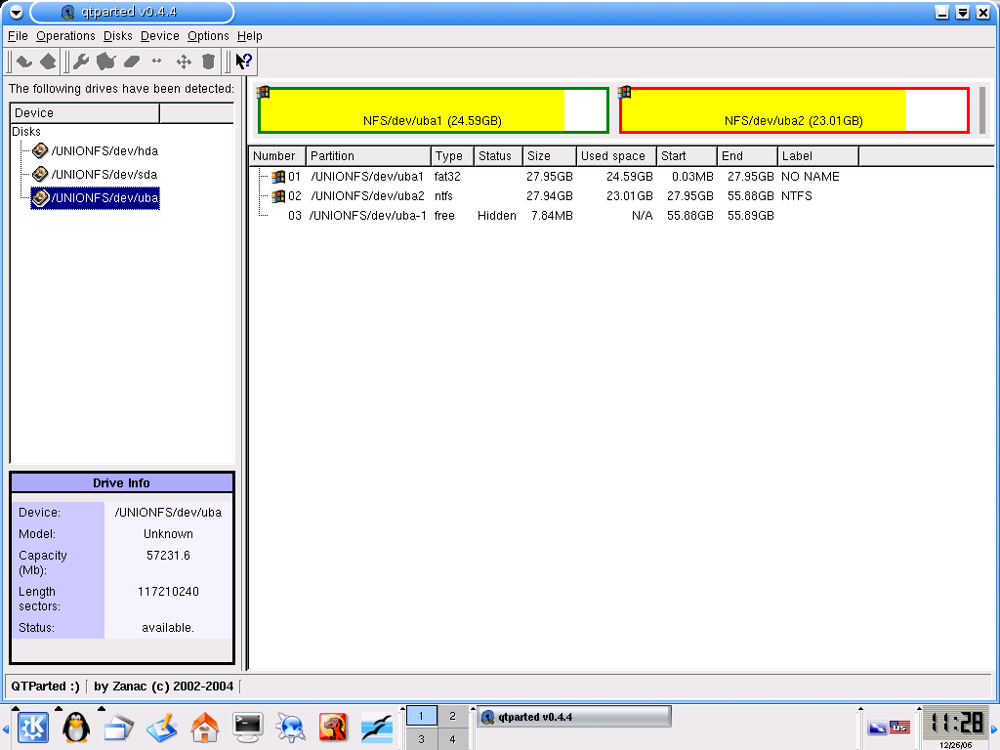

# Master boot record

This article is about a PC-specific type of boot sector on partitioned media. For the first sector on non-partitioned media, see [volume boot record](https://en.wikipedia.org/wiki/Volume_boot_record "Volume boot record").

A **master boot record** (**MBR**) is a special type of [boot sector](https://en.wikipedia.org/wiki/Boot_sector "Boot sector") at the very beginning of [partitioned](https://en.wikipedia.org/wiki/Disk_partitioning "Disk partitioning") computer [mass storage devices](https://en.wikipedia.org/wiki/Mass_storage_device "Mass storage device") like [fixed disks](https://en.wikipedia.org/wiki/Fixed_disk "Fixed disk") or [removable drives](https://en.wikipedia.org/wiki/Removable_drive "Removable drive") intended for use with [IBM PC-compatible](https://en.wikipedia.org/wiki/IBM_PC-compatible "IBM PC-compatible") systems and beyond. The concept of MBRs was publicly introduced in 1983 with [PC DOS 2.0](https://en.wikipedia.org/wiki/PC_DOS_2.0 "PC DOS 2.0").

The MBR holds the information on how the disc's sectors are divided into partitions, each partition notionally containing a file system. The MBR also contains executable code to function as a loader for the installed operating system—usually by passing control over to the loader's second stage, or in conjunction with each partition's volume boot record (VBR). This MBR code is usually referred to as a boot loader.[[1]](https://en.wikipedia.org/wiki/Master_boot_record#cite_note-FOLDOC-1)

The organization of the partition table in the MBR limits the maximum addressable storage space of a partitioned disk to 2 [TiB](https://en.wikipedia.org/wiki/Tebibyte "Tebibyte") (232 × 512 bytes).[[2]](https://en.wikipedia.org/wiki/Master_boot_record#cite_note-Microsoft_2013_2581408-2) Approaches to slightly raise this limit assuming 32-bit arithmetics or 4096-byte sectors are not officially supported, as they fatally break compatibility with existing boot loaders and most MBR-compliant operating systems and system tools, and can cause serious data corruption when used outside of narrowly controlled system environments. Therefore, the MBR-based partitioning scheme is in the process of being superseded by the [GUID Partition Table](https://en.wikipedia.org/wiki/GUID_Partition_Table "GUID Partition Table") (GPT) scheme in new computers. A GPT can coexist with an MBR in order to provide some limited form of backward compatibility for older systems.

MBRs are not present on non-partitioned media such as [floppies](https://en.wikipedia.org/wiki/Floppy "Floppy"), [superfloppies](https://en.wikipedia.org/wiki/Superfloppy "Superfloppy") or other storage devices configured to behave as such.

## Overview[[edit](https://en.wikipedia.org/w/index.php?title=Master_boot_record&action=edit&section=1 "Edit section: Overview")]

Support for partitioned media, and thereby the master boot record (MBR), was introduced with IBM [PC DOS](https://en.wikipedia.org/wiki/PC_DOS "PC DOS") 2.0 in March 1983 in order to support the 10 MB [hard disk](https://en.wikipedia.org/wiki/Hard_disk "Hard disk") of the then-new [IBM Personal Computer XT](https://en.wikipedia.org/wiki/IBM_Personal_Computer_XT "IBM Personal Computer XT"), still using the [FAT12](https://en.wikipedia.org/wiki/FAT12 "FAT12") file system. The original version of the MBR was written by David Litton of IBM in June 1982. The partition table supported up to four *primary partitions*, of which [DOS](https://en.wikipedia.org/wiki/DOS "DOS") could only use one. This did not change when [FAT16](https://en.wikipedia.org/wiki/FAT16 "FAT16") was introduced as a new file system with DOS 3.0. Support for an *[extended partition](https://en.wikipedia.org/wiki/Extended_partition "Extended partition")*, a special primary partition type used as a container to hold other partitions, was added with DOS 3.2, and nested *logical drives* inside an extended partition came with DOS 3.30. Since MS-DOS, PC DOS, OS/2 and Windows were never enabled to boot off them, the MBR format and boot code remained almost unchanged in functionality, except for in some third-party implementations, throughout the eras of DOS and OS/2 up to 1996.

In 1996, support for [logical block addressing](https://en.wikipedia.org/wiki/Logical_block_addressing "Logical block addressing") (LBA) was introduced in Windows 95B and DOS 7.10 in order to support disks larger than 8 GB. *Disk timestamps* were also introduced.[[3]](https://en.wikipedia.org/wiki/Master_boot_record#cite_note-Sedory_2004_Timestamp-3) This also reflected the idea that the MBR is meant to be operating system and file system independent. However, this design rule was partially compromised in more recent Microsoft implementations of the MBR, which enforce [CHS](https://en.wikipedia.org/wiki/Cylinder-head-sector "Cylinder-head-sector") access for [FAT16B](https://en.wikipedia.org/wiki/FAT16B "FAT16B") and [FAT32](https://en.wikipedia.org/wiki/FAT32 "FAT32") partition types [0x06](https://en.wikipedia.org/wiki/Partition_type#PID_06h "Partition type")/[0x0B](https://en.wikipedia.org/wiki/Partition_type#PID_0Bh "Partition type"), whereas LBA is used for [0x0E](https://en.wikipedia.org/wiki/Partition_type#PID_0Eh "Partition type")/[0x0C](https://en.wikipedia.org/wiki/Partition_type#PID_0Ch "Partition type").

Despite sometimes poor documentation of certain intrinsic details of the MBR format (which occasionally caused compatibility problems), it has been widely adopted as a de facto industry standard, due to the broad popularity of PC-compatible computers and its semi-static nature over decades. This was even to the extent of being supported by computer operating systems for other platforms. Sometimes this was in addition to other pre-existing or [cross-platform](https://en.wikipedia.org/wiki/Cross-platform "Cross-platform") standards for bootstrapping and partitioning.[[4]](https://en.wikipedia.org/wiki/Master_boot_record#cite_note-Lucas_2003_OpenBSD-4)

MBR partition entries and the MBR boot code used in commercial operating systems, however, are limited to 32 bits.[[2]](https://en.wikipedia.org/wiki/Master_boot_record#cite_note-Microsoft_2013_2581408-2) Therefore, the maximum disk size supported on disks using 512-byte sectors (whether real or emulated) by the MBR partitioning scheme (without 33-bit arithmetic) is limited to 2 TiB.[[2]](https://en.wikipedia.org/wiki/Master_boot_record#cite_note-Microsoft_2013_2581408-2) Consequently, a different partitioning scheme must be used for larger disks, as they have become widely available since 2010. The MBR partitioning scheme is therefore in the process of being superseded by the [GUID Partition Table](https://en.wikipedia.org/wiki/GUID_Partition_Table "GUID Partition Table") (GPT). The official approach does little more than ensuring data integrity by employing a *protective MBR*. Specifically, it does not provide backward compatibility with operating systems that do not support the GPT scheme as well. Meanwhile, multiple forms of *hybrid MBRs* have been designed and implemented by third parties in order to maintain partitions located in the first physical 2 TiB of a disk in both partitioning schemes "in parallel" and/or to allow older operating systems to boot off GPT partitions as well. The present non-standard nature of these solutions causes various compatibility problems in certain scenarios.

The MBR consists of 512 or more [bytes](https://en.wikipedia.org/wiki/Byte "Byte") located in the first [sector](https://en.wikipedia.org/wiki/Disk_sector "Disk sector") of the drive.

It may contain one or more of:

- A [partition table](https://en.wikipedia.org/wiki/Partition_table "Partition table") describing the partitions of a storage device. In this context the boot sector may also be called a *partition sector*.
- [Bootstrap code](https://en.wikipedia.org/wiki/Bootstrapping_(computing) "Bootstrapping (computing)"): Instructions to identify the configured bootable partition, then load and execute its [volume boot record](https://en.wikipedia.org/wiki/Volume_boot_record "Volume boot record") (VBR) as a [chain loader](https://en.wikipedia.org/wiki/Chain_loader "Chain loader").
- Optional 32-bit *disk timestamp*.[[3]](https://en.wikipedia.org/wiki/Master_boot_record#cite_note-Sedory_2004_Timestamp-3)
- Optional 32-bit *disk signature*.[[5]](https://en.wikipedia.org/wiki/Master_boot_record#cite_note-Norton_2002_Inside-5)[[6]](https://en.wikipedia.org/wiki/Master_boot_record#cite_note-Graves_2004_Guide-6)[[7]](https://en.wikipedia.org/wiki/Master_boot_record#cite_note-Andrews_2003_Upgrade-7)[[8]](https://en.wikipedia.org/wiki/Master_boot_record#cite_note-Boswell_2003_Inside-8)

## Disk partitioning[[edit](https://en.wikipedia.org/w/index.php?title=Master_boot_record&action=edit&section=2 "Edit section: Disk partitioning")]

[IBM](https://en.wikipedia.org/wiki/IBM "IBM") [PC DOS](https://en.wikipedia.org/wiki/PC_DOS "PC DOS") 2.0 introduced the `[FDISK](https://en.wikipedia.org/wiki/FDISK "FDISK")` utility to set up and maintain MBR partitions. When a storage device has been partitioned according to this scheme, its MBR contains a partition table describing the locations, sizes, and other attributes of linear regions referred to as partitions.

The partitions themselves may also contain data to describe more complex partitioning schemes, such as [extended boot records](https://en.wikipedia.org/wiki/Extended_boot_record "Extended boot record") (EBRs), [BSD disklabels](https://en.wikipedia.org/wiki/BSD_disklabel "BSD disklabel"), or [Logical Disk Manager](https://en.wikipedia.org/wiki/Logical_Disk_Manager "Logical Disk Manager") metadata partitions.[[9]](https://en.wikipedia.org/wiki/Master_boot_record#cite_note-Smith_2000_Multi-Boot-9)

The MBR is not located in a partition; it is located at a first sector of the device (physical offset 0), preceding the first partition. (The boot sector present on a non-partitioned device or within an individual partition is called a [volume boot record](https://en.wikipedia.org/wiki/Volume_boot_record "Volume boot record") instead.) In cases where the computer is running a [DDO BIOS overlay](https://en.wikipedia.org/wiki/Dynamic_Drive_Overlay "Dynamic Drive Overlay") or [boot manager](https://en.wikipedia.org/wiki/Boot_manager "Boot manager"), the partition table may be moved to some other physical location on the device; e.g., [Ontrack Disk Manager](https://en.wikipedia.org/wiki/Ontrack_Disk_Manager "Ontrack Disk Manager") often placed a copy of the original MBR contents in the second sector, then hid itself from any subsequently booted OS or application, so the MBR copy was treated as if it were still residing in the first sector.

### Sector layout[[edit](https://en.wikipedia.org/w/index.php?title=Master_boot_record&action=edit&section=3 "Edit section: Sector layout")]

By convention, there are exactly four primary partition table entries in the MBR partition table scheme, although some operating systems and system tools extended this to five (Advanced Active Partitions (AAP) with [PTS-DOS](https://en.wikipedia.org/wiki/PTS-DOS "PTS-DOS") 6.60[[10]](https://en.wikipedia.org/wiki/Master_boot_record#cite_note-Brouwer_2003_Types-2A-10) and [DR-DOS](https://en.wikipedia.org/wiki/DR-DOS "DR-DOS") 7.07), eight ([AST](https://en.wikipedia.org/wiki/AST_Research "AST Research") and [NEC](https://en.wikipedia.org/wiki/NEC "NEC") [MS-DOS](https://en.wikipedia.org/wiki/MS-DOS "MS-DOS") 3.x[[11]](https://en.wikipedia.org/wiki/Master_boot_record#cite_note-Brouwer_2003_Types-2B-11)[[12]](https://en.wikipedia.org/wiki/Master_boot_record#cite_note-Sedory_2007_DOS33MBR-12) as well as [Storage Dimensions](https://en.wikipedia.org/w/index.php?title=Storage_Dimensions&action=edit&redlink=1 "Storage Dimensions (page does not exist)") [SpeedStor](https://en.wikipedia.org/w/index.php?title=SpeedStor&action=edit&redlink=1 "SpeedStor (page does not exist)")), or even sixteen entries (with [Ontrack Disk Manager](https://en.wikipedia.org/wiki/Ontrack_Disk_Manager "Ontrack Disk Manager")).

<div>
<table class="wikitable" style="float:left; width:45%; margin:1em;">
<caption>Structure of a classical generic MBR
</caption>
<tbody><tr>
<th>Address
</th>
<th style="vertical-align:middle" colspan="2">Description
</th>
<th style="vertical-align:middle">Size<br>(<a href="/wiki/Byte" title="Byte">bytes</a>)
</th></tr>

<tr style="height:540px">
<td style="text-align:center"><span class="anchor" id="MBROLD_OFS_000h"></span><code>0x0000</code> (0)
</td>
<td colspan="2">Bootstrap code area
</td>
<td style="text-align:center">446
</td></tr>
<tr style="height:60px">
<td style="text-align:center"><span class="anchor" id="MBROLD_OFS_1BEh"></span><span class="anchor" id="P1"></span><code>0x01BE</code> (446)
</td>
<td style="text-align:center"><a href="#PTE">Partition entry</a> №1
</td>
<td rowspan="4" style="vertical-align:middle; text-align:center"><i>Partition table</i><br>(for primary partitions)
</td>
<td style="text-align:center">16
</td></tr>
<tr style="height:60px">
<td style="text-align:center"><span class="anchor" id="MBROLD_OFS_1CEh"></span><span class="anchor" id="P2"></span><code>0x01CE</code> (462)
</td>
<td style="text-align:center"><a href="#PTE">Partition entry</a> №2
</td>
<td style="text-align:center">16
</td></tr>
<tr style="height:60px">
<td style="text-align:center"><span class="anchor" id="MBROLD_OFS_1DEh"></span><span class="anchor" id="P3"></span><code>0x01DE</code> (478)
</td>
<td style="text-align:center"><a href="#PTE">Partition entry</a> №3
</td>
<td style="text-align:center">16
</td></tr>
<tr style="height:60px">
<td style="text-align:center"><span class="anchor" id="MBROLD_OFS_1EEh"></span><span class="anchor" id="P4"></span><code>0x01EE</code> (494)
</td>
<td style="text-align:center"><a href="#PTE">Partition entry</a> №4
</td>
<td style="text-align:center">16
</td></tr>
<tr style="height:60px">
<td style="text-align:center"><span class="anchor" id="MBROLD_OFS_1FEh"></span><code>0x01FE</code> (510)
</td>
<td style="text-align:center"><code>0x55</code>
</td>
<td rowspan="2" style="vertical-align:middle; text-align:center"><i>Boot signature</i><sup id="cite_ref-NB_Magic_AA55_13-0" class="reference"><a href="#cite_note-NB_Magic_AA55-13">[a]</a></sup>
</td>
<td rowspan="2" style="text-align:center">2
</td></tr>
<tr style="height:60px">
<td style="text-align:center"><span class="anchor" id="MBROLD_OFS_1FFh"></span><code>0x01FF</code> (511)
</td>
<td style="text-align:center"><code>0xAA</code>
</td></tr>
<tr style="height:60px">
<th colspan="3" style="text-align:right;">Total size: 446 + 4×16 + 2
</th>
<th style="text-align:center">512
</th></tr></tbody></table>

<p></p>
<table class="wikitable" style="float:right; width:45%; margin:1em;">
<caption>Structure of a modern standard MBR
</caption>
<tbody><tr>
<th>Address
</th>
<th style="vertical-align:middle" colspan="2">Description
</th>
<th style="vertical-align:middle">Size<br>(<a href="/wiki/Byte" title="Byte">bytes</a>)
</th></tr>

<tr style="height:60px">
<td style="text-align:center"><span class="anchor" id="MBRNEW_OFS_000h"></span><code>0x0000</code> (0)</td>
<td colspan="2">Bootstrap code area (part 1)
</td>
<td style="text-align:center">218
</td></tr>
<tr style="height:60px">
<td style="text-align:center"><span class="anchor" id="MBRNEW_OFS_0DAh"></span><span class="anchor" id="DISK_TS"></span><code>0x00DA</code> (218)
</td>
<td style="text-align:center; background:#F2F2F2"><code>0x0000</code>
</td>
<td rowspan="5" style="vertical-align:middle; text-align:center; background:#F2F2F2"><i>Disk timestamp</i><sup id="cite_ref-Sedory_2004_Timestamp_3-2" class="reference"><a href="#cite_note-Sedory_2004_Timestamp-3">[3]</a></sup><sup id="cite_ref-NB_Timestamp_14-0" class="reference"><a href="#cite_note-NB_Timestamp-14">[b]</a></sup> (optional; Windows 95B/98/98SE/ME (MS-DOS 7.1–8.0). Alternatively, can serve as <a href="#NEWLDR_OFS_018h">OEM loader signature</a> with NEWLDR)
</td>
<td style="text-align:center">2
</td></tr>
<tr style="height:60px">
<td style="text-align:center"><span class="anchor" id="MBRNEW_OFS_0DCh"></span><code>0x00DC</code> (220)
</td>
<td style="text-align:center; background:#F2F2F2"><span class="nowrap">Original physical drive</span> <span class="nowrap">(<code>0x80</code>–<code>0xFF</code>)</span>
</td>
<td style="text-align:center">1
</td></tr>
<tr style="height:60px">
<td style="text-align:center"><span class="anchor" id="MBRNEW_OFS_0DDh"></span><code>0x00DD</code> (221)
</td>
<td style="text-align:center; background:#F2F2F2">Seconds (0–59)
</td>
<td style="text-align:center">1
</td></tr>
<tr style="height:60px">
<td style="text-align:center"><span class="anchor" id="MBRNEW_OFS_0DEh"></span><code>0x00DE</code> (222)
</td>
<td style="text-align:center; background:#F2F2F2">Minutes (0–59)
</td>
<td style="text-align:center">1
</td></tr>
<tr style="height:60px">
<td style="text-align:center"><span class="anchor" id="MBRNEW_OFS_0DFh"></span><code>0x00DF</code> (223)
</td>
<td style="text-align:center; background:#F2F2F2">Hours (0–23)
</td>
<td style="text-align:center">1
</td></tr>
<tr style="height:60px">
<td style="text-align:center"><span class="anchor" id="MBRNEW_OFS_0E0h"></span><code>0x00E0</code> (224)</td>
<td colspan="2">Bootstrap code area (part 2, code entry at <code>0x0000</code>)
</td>
<td style="text-align:center">216 (or 222)
</td></tr>
<tr style="height:60px">
<td style="text-align:center"><span class="anchor" id="MBRNEW_OFS_1B8h"></span><span class="anchor" id="DISK_ID"></span><code>0x01B8</code> (440)
</td>
<td style="text-align:center; background:#F2F2F2">32-bit disk signature
</td>
<td rowspan="2" style="vertical-align:middle; text-align:center; background:#F2F2F2"><i>Disk signature</i> (optional; <a href="/wiki/Unified_Extensible_Firmware_Interface" class="mw-redirect" title="Unified Extensible Firmware Interface">UEFI</a>, Linux, <a href="/wiki/Windows_NT" title="Windows NT">Windows NT</a> family and other OSes)
</td>
<td style="text-align:center">4
</td></tr>
<tr style="height:60px">
<td style="text-align:center"><span class="anchor" id="MBRNEW_OFS_1BCh"></span><code>0x01BC</code> (444)
</td>
<td style="text-align:center; background:#F2F2F2"><code>0x0000</code> (<code>0x5A5A</code> if copy-protected)
</td>
<td style="text-align:center">2
</td></tr>
<tr style="height:60px">
<td style="text-align:center"><span class="anchor" id="MBRNEW_OFS_1BEh"></span><code>0x01BE</code> (446)
</td>
<td style="text-align:center"><a href="#PTE">Partition entry</a> №1
</td>
<td rowspan="4" style="vertical-align:middle; text-align:center"><i>Partition table</i><br>(for primary partitions)
</td>
<td style="text-align:center">16
</td></tr>
<tr style="height:60px">
<td style="text-align:center"><span class="anchor" id="MBRNEW_OFS_1CEh"></span><code>0x01CE</code> (462)
</td>
<td style="text-align:center"><a href="#PTE">Partition entry</a> №2
</td>
<td style="text-align:center">16
</td></tr>
<tr style="height:60px">
<td style="text-align:center"><span class="anchor" id="MBRNEW_OFS_1DEh"></span><code>0x01DE</code> (478)
</td>
<td style="text-align:center"><a href="#PTE">Partition entry</a> №3
</td>
<td style="text-align:center">16
</td></tr>
<tr style="height:60px">
<td style="text-align:center"><span class="anchor" id="MBRNEW_OFS_1EEh"></span><code>0x01EE</code> (494)
</td>
<td style="text-align:center"><a href="#PTE">Partition entry</a> №4
</td>
<td style="text-align:center">16
</td></tr>
<tr style="height:60px">
<td style="text-align:center"><span class="anchor" id="MBRNEW_OFS_1FEh"></span><code>0x01FE</code> (510)
</td>
<td style="text-align:center"><code>0x55</code>
</td>
<td rowspan="2" style="vertical-align:middle; text-align:center"><i>Boot signature</i><sup id="cite_ref-NB_Magic_AA55_13-1" class="reference"><a href="#cite_note-NB_Magic_AA55-13">[a]</a></sup>
</td>
<td rowspan="2" style="text-align:center">2
</td></tr>
<tr style="height:60px">
<td style="text-align:center"><span class="anchor" id="MBRNEW_OFS_1FFh"></span><code>0x01FF</code> (511)
</td>
<td style="text-align:center"><code>0xAA</code>
</td></tr>
<tr style="height:60px">
<th colspan="3" style="text-align:right;">Total size: 218 + 6 + 216 + 6 + 4×16 + 2
</th>
<th style="text-align:center">512
</th></tr></tbody></table>

<p></p>
<table class="wikitable" style="float:left; width:45%; margin:1em;">
<caption>Structure of AAP MBR
</caption>
<tbody><tr>
<th>Address
</th>
<th style="vertical-align:middle" colspan="2">Description
</th>
<th style="vertical-align:middle">Size<br>(<a href="/wiki/Byte" title="Byte">bytes</a>)
</th></tr>
<tr>
<td style="text-align:center"><span class="anchor" id="MBRAAP_OFS_000h"></span><code>0x0000</code> (0)</td>
<td colspan="2">Bootstrap code area
</td>
<td style="text-align:center">428
</td></tr>
<tr>
<td style="text-align:center"><span class="anchor" id="MBRAAP_OFS_1ACh"></span><code>0x01AC</code> (428)
</td>
<td style="text-align:center; background:#F2F2F2"><code>0x78</code>
</td>
<td rowspan="2" style="vertical-align:middle; text-align:center; background:#F2F2F2"><i>AAP signature</i> (optional)
</td>
<td rowspan="2" style="text-align:center">2
</td></tr>
<tr>
<td style="text-align:center"><span class="anchor" id="MBRAAP_OFS_1ADh"></span><code>0x01AD</code> (429)
</td>
<td style="text-align:center; background:#F2F2F2"><code>0x56</code>
</td></tr>
<tr>
<td style="text-align:center"><span class="anchor" id="MBRAAP_OFS_1AEh"></span><code>0x01AE</code> (430)
</td>
<td style="text-align:center; background:#F2F2F2">AAP physical drive (<code>0x80</code>-<code>0xFE</code>; <code>0x00</code>: not used; <code>0x01</code>-<code>0x7F</code>, <code>0xFF</code>: reserved)
</td>
<td rowspan="6" style="vertical-align:middle; text-align:center; background:#F2F2F2"><i>AAP record</i> (optional) (AAP <a href="#PTE">partition entry</a> #0 with special semantics)
</td>
<td style="text-align:center">1
</td></tr>
<tr>
<td style="text-align:center"><span class="anchor" id="MBRAAP_OFS_1AFh"></span><code>0x01AF</code> (431)
</td>
<td style="text-align:center; background:#F2F2F2"><a href="/wiki/Cylinder-head-sector" title="Cylinder-head-sector">CHS</a> (start) address of AAP partition/image file or <a href="/wiki/Volume_boot_record" title="Volume boot record">VBR</a>/<a href="/wiki/Extended_boot_record" title="Extended boot record">EBR</a>
</td>
<td style="text-align:center">3
</td></tr>
<tr>
<td style="text-align:center"><span class="anchor" id="MBRAAP_OFS_1B2h"></span><code>0x01B2</code> (434)
</td>
<td style="text-align:center; background:#F2F2F2">Reserved for AAP <a href="/wiki/Partition_type" title="Partition type">partition type</a> (<code>0x00</code> if not used) (optional)
</td>
<td style="text-align:center">1
</td></tr>
<tr>
<td style="text-align:center"><span class="anchor" id="MBRAAP_OFS_1B3h"></span><span class="anchor" id="MBRAAP_OFS_1B5h"></span><code>0x01B3</code> (435)
</td>
<td style="text-align:center; background:#F2F2F2">Reserved for CHS end address in AAP (optional; byte at offset <code>0x01B5</code> is also used for MBR checksum (PTS DE, BootWizard); <code>0x000000</code> if not used)
</td>
<td style="text-align:center">3
</td></tr>
<tr>
<td style="text-align:center"><span class="anchor" id="MBRAAP_OFS_1B6h"></span><code>0x01B6</code> (438)
</td>
<td style="text-align:center; background:#F2F2F2">Start <a href="/wiki/Logical_block_addressing" title="Logical block addressing">LBA</a> of AAP image file or <a href="/wiki/Volume_boot_record" title="Volume boot record">VBR</a>/<a href="/wiki/Extended_boot_record" title="Extended boot record">EBR</a> or relative sectors of AAP partition (copied to offset <code><a href="/wiki/Design_of_the_FAT_file_system#BPB331_OFS_11h" title="Design of the FAT file system">+01C<sub>hex</sub></a></code> in the loaded sector over the "hidden sectors" entry of a DOS 3.31 BPB (or emulation thereof) to also support EBR booting)
</td>
<td style="text-align:center">4
</td></tr>
<tr>
<td style="text-align:center"><span class="anchor" id="MBRAAP_OFS_1BAh"></span><code>0x01BA</code> (442)
</td>
<td style="text-align:center; background:#F2F2F2">Reserved for sectors in AAP (optional; <code>0x00000000</code> if not used)
</td>
<td style="text-align:center">4
</td></tr>
<tr>
<td style="text-align:center"><span class="anchor" id="MBRAAP_OFS_1BEh"></span><code>0x01BE</code> (446)
</td>
<td style="text-align:center"><a href="#PTE">Partition entry</a> №1
</td>
<td rowspan="4" style="vertical-align:middle; text-align:center"><i>Partition table</i><br>(for primary partitions)
</td>
<td style="text-align:center">16
</td></tr>
<tr>
<td style="text-align:center"><span class="anchor" id="MBRAAP_OFS_1CEh"></span><code>0x01CE</code> (462)
</td>
<td style="text-align:center"><a href="#PTE">Partition entry</a> №2
</td>
<td style="text-align:center">16
</td></tr>
<tr>
<td style="text-align:center"><span class="anchor" id="MBRAAP_OFS_1DEh"></span><code>0x01DE</code> (478)
</td>
<td style="text-align:center"><a href="#PTE">Partition entry</a> №3
</td>
<td style="text-align:center">16
</td></tr>
<tr>
<td style="text-align:center"><span class="anchor" id="MBRAAP_OFS_1EEh"></span><code>0x01EE</code> (494)
</td>
<td style="text-align:center"><a href="#PTE">Partition entry</a> №4
</td>
<td style="text-align:center">16
</td></tr>
<tr>
<td style="text-align:center"><span class="anchor" id="MBRAAP_OFS_1FEh"></span><code>0x01FE</code> (510)
</td>
<td style="text-align:center"><code>0x55</code>
</td>
<td rowspan="2" style="vertical-align:middle; text-align:center"><i>Boot signature</i><sup id="cite_ref-NB_Magic_AA55_13-2" class="reference"><a href="#cite_note-NB_Magic_AA55-13">[a]</a></sup>
</td>
<td rowspan="2" style="text-align:center">2
</td></tr>
<tr>
<td style="text-align:center"><span class="anchor" id="MBRAAP_OFS_1FFh"></span><code>0x01FF</code> (511)
</td>
<td style="text-align:center"><code>0xAA</code>
</td></tr>
<tr>
<th colspan="3" style="text-align:right;">Total size: 428 + 2 + 16 + 4×16 + 2
</th>
<th>512
</th></tr></tbody></table>

<p></p>
<table class="wikitable" style="float:right; width:45%; margin:1em;">
<caption>Structure of NEWLDR MBR
</caption>
<tbody><tr>
<th>Address
</th>
<th style="vertical-align:middle" colspan="2">Description
</th>
<th style="vertical-align:middle">Size<br>(<a href="/wiki/Byte" title="Byte">bytes</a>)
</th></tr>

<tr>
<td style="text-align:center"><span class="anchor" id="NEWLDR_OFS_000h"></span><span class="anchor" id="NEWLDR_OFS_001h"></span><code>0x0000</code> (0)
</td>
<td style="text-align:center; background:#F2F2F2">JMPS (<code><a href="/wiki/X86_instruction_listings" title="X86 instruction listings">EB<sub>hex</sub></a></code>) / NEWLDR record size (often <code>0x0A</code>/<code>0x16</code>/<code>0x1C</code> for code start at <code>0x000C</code>/<code>0x0018</code>/<code>0x001E</code>)
</td>
<td rowspan="10" style="vertical-align:middle; text-align:center; background:#F2F2F2"><i>NEWLDR record</i> (optional)
</td>
<td style="text-align:center">2
</td></tr>
<tr>
<td style="text-align:center"><span class="anchor" id="NEWLDR_OFS_002h"></span><code>0x0002</code> (2)
</td>
<td style="text-align:center; background:#F2F2F2">"<code>NEWLDR</code>" signature
</td>
<td style="text-align:center">6
</td></tr>
<tr>
<td style="text-align:center"><span class="anchor" id="NEWLDR_OFS_008h"></span><code>0x0008</code> (8)
</td>
<td style="text-align:center; background:#F2F2F2">LOADER physical drive and boot flag (<code>0x80</code>-<code>0xFE</code>, <code>0x00</code>-<code>0x7E</code>, <code>0xFF</code>, <code>0x7F</code>) (if not used, this and following 3 bytes must be all 0)
</td>
<td style="text-align:center">1
</td></tr>
<tr>
<td style="text-align:center"><span class="anchor" id="NEWLDR_OFS_009h"></span><code>0x0009</code> (9)
</td>
<td style="text-align:center; background:#F2F2F2"><a href="/wiki/Cylinder-head-sector" title="Cylinder-head-sector">CHS</a> address of LOADER boot sector or image file (f.e. <a href="/wiki/IBMBIO.LDR" class="mw-redirect" title="IBMBIO.LDR">IBMBIO.LDR</a>) (<code>0x000000</code> if not used)
</td>
<td style="text-align:center">3
</td></tr>
<tr>
<td style="text-align:center"><span class="anchor" id="NEWLDR_OFS_00Ch"></span><code>0x000C</code> (12)
</td>
<td style="text-align:center; background:#F2F2F2">Allowed <a href="/wiki/DL_register" class="mw-redirect" title="DL register">DL</a> minimum, else take from partition table (<code>0x80</code>: default; <code>0x00</code>: always use DL; <code>0xFF</code>: always use table entry)
</td>
<td style="text-align:center">1
</td></tr>
<tr>
<td style="text-align:center"><span class="anchor" id="NEWLDR_OFS_00Dh"></span><code>0x000D</code> (13)
</td>
<td style="text-align:center; background:#F2F2F2">Reserved (default: <code>0x000000</code>)
</td>
<td style="text-align:center">3
</td></tr>
<tr>
<td style="text-align:center"><span class="anchor" id="NEWLDR_OFS_010h"></span><code>0x0010</code> (16)
</td>
<td style="text-align:center; background:#F2F2F2"><a href="/wiki/Logical_block_addressing" title="Logical block addressing">LBA</a> of LOADER boot sector or image file (optional; <code>0x00000000</code> if not used)
</td>
<td style="text-align:center">4
</td></tr>
<tr>
<td style="text-align:center"><span class="anchor" id="NEWLDR_OFS_014h"></span><code>0x0014</code> (20)
</td>
<td style="text-align:center; background:#F2F2F2">Patch offset of VBR boot unit (default <code>0x0000</code> if not used, else <code><a href="/wiki/Design_of_the_FAT_file_system#EBPB_OFS_19h" title="Design of the FAT file system">0024<sub>hex</sub></a></code> or <code><a href="/wiki/Design_of_the_FAT_file_system#BSIBM_OFS_1FDh" title="Design of the FAT file system">01FD<sub>hex</sub></a></code>)
</td>
<td style="text-align:center">2
</td></tr>
<tr>
<td style="text-align:center"><span class="anchor" id="NEWLDR_OFS_016h"></span><code>0x0016</code> (22)
</td>
<td style="text-align:center; background:#F2F2F2">Checksum (<code>0x0000</code> if not used)
</td>
<td style="text-align:center">2
</td></tr>
<tr>
<td style="text-align:center"><span class="anchor" id="NEWLDR_OFS_018h"></span><code>0x0018</code> (24)
</td>
<td style="text-align:center; background:#F2F2F2">OEM loader signature ("<code>MSWIN4</code>" for <a href="/wiki/REAL/32" class="mw-redirect" title="REAL/32">REAL/32</a>, see also offset <code><a href="#MBRNEW_OFS_0DAh">+0DA<sub>hex</sub></a></code>, corresponds with OEM label at offset <code><a href="/wiki/Design_of_the_FAT_file_system#BSIBM_OFS_003h" title="Design of the FAT file system">+003<sub>hex</sub></a></code> in VBRs (optional)
</td>
<td style="text-align:center">6
</td></tr>
<tr>
<td style="text-align:center"><i>Varies</i>
</td>
<td colspan="2">Bootstrap code area (code entry at <code>0x0000</code>)
</td>
<td style="text-align:center"><i>Varies</i>
</td></tr>
<tr>
<td style="text-align:center"><span class="anchor" id="NEWLDR_OFS_1ACh"></span><code>0x01AC</code> (428)
</td>
<td style="text-align:center; background:#F2F2F2"><code>0x78</code>
</td>
<td rowspan="2" style="vertical-align:middle; text-align:center; background:#F2F2F2"><i>AAP signature</i> (optional)
</td>
<td rowspan="2" style="text-align:center">2
</td></tr>
<tr>
<td style="text-align:center"><span class="anchor" id="NEWLDR_OFS_1ADh"></span><code>0x01AD</code> (429)
</td>
<td style="text-align:center; background:#F2F2F2"><code>0x56</code>
</td></tr>
<tr>
<td style="text-align:center"><span class="anchor" id="NEWLDR_OFS_1AEh"></span><code>0x01AE</code> (430)
</td>
<td style="text-align:center; background:#F2F2F2">AAP partition entry №0 with special semantics
</td>
<td style="text-align:center; background:#F2F2F2"><i>AAP record</i> (optional)
</td>
<td style="text-align:center">16
</td></tr>
<tr>
<td style="text-align:center"><span class="anchor" id="NEWLDR_OFS_1BEh"></span><code>0x01BE</code> (446)
</td>
<td style="text-align:center"><a href="#PTE">Partition entry</a> №1
</td>
<td rowspan="4" style="vertical-align:middle; text-align:center"><i>Partition table</i><br>(for primary partitions)
</td>
<td style="text-align:center">16
</td></tr>
<tr>
<td style="text-align:center"><span class="anchor" id="NEWLDR_OFS_1CEh"></span><code>0x01CE</code> (462)
</td>
<td style="text-align:center"><a href="#PTE">Partition entry</a> №2
</td>
<td style="text-align:center">16
</td></tr>
<tr>
<td style="text-align:center"><span class="anchor" id="NEWLDR_OFS_1DEh"></span><code>0x01DE</code> (478)
</td>
<td style="text-align:center"><a href="#PTE">Partition entry</a> №3
</td>
<td style="text-align:center">16
</td></tr>
<tr>
<td style="text-align:center"><span class="anchor" id="NEWLDR_OFS_1EEh"></span><code>0x01EE</code> (494)
</td>
<td style="text-align:center"><a href="#PTE">Partition entry</a> №4
</td>
<td style="text-align:center">16
</td></tr>
<tr>
<td style="text-align:center"><span class="anchor" id="NEWLDR_OFS_1FEh"></span><code>0x01FE</code> (510)
</td>
<td style="text-align:center"><code>0x55</code>
</td>
<td rowspan="2" style="vertical-align:middle; text-align:center"><i>Boot signature</i><sup id="cite_ref-NB_Magic_AA55_13-3" class="reference"><a href="#cite_note-NB_Magic_AA55-13">[a]</a></sup>
</td>
<td rowspan="2" style="text-align:center">2
</td></tr>
<tr>
<td style="text-align:center"><span class="anchor" id="NEWLDR_OFS_1FFh"></span><code>0x01FF</code> (511)
</td>
<td style="text-align:center"><code>0xAA</code>
</td></tr>
<tr>
<th colspan="3" style="text-align:right;">Total size: 30 + 398 + 2 + 16 + 4×16 + 2
</th>
<th>512
</th></tr></tbody></table>

<p></p>
<table class="wikitable" style="float:left; width:45%; margin:1em;">
<caption>Structure of AST/NEC MS-DOS and SpeedStor MBR
</caption>
<tbody><tr>
<th>Address
</th>
<th style="vertical-align:middle" colspan="2">Description
</th>
<th style="vertical-align:middle">Size<br>(<a href="/wiki/Byte" title="Byte">bytes</a>)
</th></tr>

<tr>
<td style="text-align:center"><span class="anchor" id="MBR8PT_OFS_000h"></span><code>0x0000</code> (0)</td>
<td colspan="2">Bootstrap code area
</td>
<td style="text-align:center">380
</td></tr>
<tr>
<td style="text-align:center"><span class="anchor" id="MBR8PT_OFS_17Ch"></span><code>0x017C</code> (380)
</td>
<td style="text-align:center; background:#F2F2F2"><code>0x5A</code>
</td>
<td rowspan="2" style="vertical-align:middle; text-align:center; background:#F2F2F2"><i>AST/NEC signature</i> (optional; not for SpeedStor)
</td>
<td rowspan="2" style="text-align:center">2
</td></tr>
<tr>
<td style="text-align:center"><span class="anchor" id="MBR8PT_OFS_17Dh"></span><code>0x017D</code> (381)
</td>
<td style="text-align:center; background:#F2F2F2"><code>0xA5</code>
</td></tr>
<tr>
<td style="text-align:center"><span class="anchor" id="MBR8PT_OFS_17Eh"></span><code>0x017E</code> (382)
</td>
<td style="text-align:center; background:#F2F2F2"><a href="#PTE">Partition entry</a> №8
</td>
<td rowspan="4" style="vertical-align:middle; text-align:center; background:#F2F2F2"><i>AST/NEC expanded partition table</i><br>(optional; also for SpeedStor)
</td>
<td style="text-align:center">16
</td></tr>
<tr>
<td style="text-align:center"><span class="anchor" id="MBR8PT_OFS_18Eh"></span><code>0x018E</code> (398)
</td>
<td style="text-align:center; background:#F2F2F2"><a href="#PTE">Partition entry</a> №7
</td>
<td style="text-align:center">16
</td></tr>
<tr>
<td style="text-align:center"><span class="anchor" id="MBR8PT_OFS_19Eh"></span><code>0x019E</code> (414)
</td>
<td style="text-align:center; background:#F2F2F2"><a href="#PTE">Partition entry</a> №6
</td>
<td style="text-align:center">16
</td></tr>
<tr>
<td style="text-align:center"><span class="anchor" id="MBR8PT_OFS_1AEh"></span><code>0x01AE</code> (430)
</td>
<td style="text-align:center; background:#F2F2F2"><a href="#PTE">Partition entry</a> №5
</td>
<td style="text-align:center">16
</td></tr>
<tr>
<td style="text-align:center"><span class="anchor" id="MBR8PT_OFS_1BEh"></span><code>0x01BE</code> (446)
</td>
<td style="text-align:center"><a href="#PTE">Partition entry</a> №4
</td>
<td rowspan="4" style="vertical-align:middle; text-align:center"><i>Partition table</i><br>(for primary partitions)
</td>
<td style="text-align:center">16
</td></tr>
<tr>
<td style="text-align:center"><span class="anchor" id="MBR8PT_OFS_1CEh"></span><code>0x01CE</code> (462)
</td>
<td style="text-align:center"><a href="#PTE">Partition entry</a> №3
</td>
<td style="text-align:center">16
</td></tr>
<tr>
<td style="text-align:center"><span class="anchor" id="MBR8PT_OFS_1DEh"></span><code>0x01DE</code> (478)
</td>
<td style="text-align:center"><a href="#PTE">Partition entry</a> №2
</td>
<td style="text-align:center">16
</td></tr>
<tr>
<td style="text-align:center"><span class="anchor" id="MBR8PT_OFS_1EEh"></span><code>0x01EE</code> (494)
</td>
<td style="text-align:center"><a href="#PTE">Partition entry</a> №1
</td>
<td style="text-align:center">16
</td></tr>
<tr>
<td style="text-align:center"><span class="anchor" id="MBR8PT_OFS_1FEh"></span><code>0x01FE</code> (510)
</td>
<td style="text-align:center"><code>0x55</code>
</td>
<td rowspan="2" style="vertical-align:middle; text-align:center"><i>Boot signature</i><sup id="cite_ref-NB_Magic_AA55_13-4" class="reference"><a href="#cite_note-NB_Magic_AA55-13">[a]</a></sup>
</td>
<td rowspan="2" style="text-align:center">2
</td></tr>
<tr>
<td style="text-align:center"><span class="anchor" id="MBR8PT_OFS_1FFh"></span><code>0x01FF</code> (511)
</td>
<td style="text-align:center"><code>0xAA</code>
</td></tr>
<tr>
<th colspan="3" style="text-align:right;">Total size: 380 + 2 + 4×16 + 4×16 + 2
</th>
<th>512
</th></tr></tbody></table>

<p></p>
<table class="wikitable" style="float:right; width:45%; margin:1em;">
<caption>Structure of Ontrack Disk Manager MBR
</caption>
<tbody><tr>
<th>Address
</th>
<th style="vertical-align:middle" colspan="2">Description
</th>
<th style="vertical-align:middle">Size<br>(<a href="/wiki/Byte" title="Byte">bytes</a>)
</th></tr>

<tr>
<td style="text-align:center"><span class="anchor" id="MBRODM_OFS_000h"></span><code>0x0000</code> (0)</td>
<td colspan="2">Bootstrap code area
</td>
<td style="text-align:center">252
</td></tr>
<tr>
<td style="text-align:center"><span class="anchor" id="MBRODM_OFS_0FCh"></span><code>0x00FC</code> (252)
</td>
<td style="text-align:center; background:#F2F2F2"><code>0xAA</code>
</td>
<td rowspan="2" style="vertical-align:middle; text-align:center; background:#F2F2F2"><i>DM signature</i> (optional)
</td>
<td rowspan="2" style="text-align:center">2
</td></tr>
<tr>
<td style="text-align:center"><span class="anchor" id="MBRODM_OFS_0FDh"></span><code>0x00FD</code> (253)
</td>
<td style="text-align:center; background:#F2F2F2"><code>0x55</code>
</td></tr>
<tr>
<td style="text-align:center"><span class="anchor" id="MBRODM_OFS_0FEh"></span><code>0x00FE</code> (254)
</td>
<td style="text-align:center; background:#F2F2F2"><a href="#PTE">Partition entry</a>
</td>
<td rowspan="12" style="vertical-align:middle; text-align:center; background:#F2F2F2"><i>DM expanded partition table</i><br>(optional)
</td>
<td style="text-align:center">16
</td></tr>
<tr>
<td style="text-align:center"><span class="anchor" id="MBRODM_OFS_10Eh"></span><code>0x010E</code> (270)
</td>
<td style="text-align:center; background:#F2F2F2"><a href="#PTE">Partition entry</a>
</td>
<td style="text-align:center">16
</td></tr>
<tr>
<td style="text-align:center"><span class="anchor" id="MBRODM_OFS_11Eh"></span><code>0x011E</code> (286)
</td>
<td style="text-align:center; background:#F2F2F2"><a href="#PTE">Partition entry</a>
</td>
<td style="text-align:center">16
</td></tr>
<tr>
<td style="text-align:center"><span class="anchor" id="MBRODM_OFS_12Eh"></span><code>0x012E</code> (302)
</td>
<td style="text-align:center; background:#F2F2F2"><a href="#PTE">Partition entry</a>
</td>
<td style="text-align:center">16
</td></tr>
<tr>
<td style="text-align:center"><span class="anchor" id="MBRODM_OFS_13Eh"></span><code>0x013E</code> (318)
</td>
<td style="text-align:center; background:#F2F2F2"><a href="#PTE">Partition entry</a>
</td>
<td style="text-align:center">16
</td></tr>
<tr>
<td style="text-align:center"><span class="anchor" id="MBRODM_OFS_14Eh"></span><code>0x014E</code> (334)
</td>
<td style="text-align:center; background:#F2F2F2"><a href="#PTE">Partition entry</a>
</td>
<td style="text-align:center">16
</td></tr>
<tr>
<td style="text-align:center"><span class="anchor" id="MBRODM_OFS_15Eh"></span><code>0x015E</code> (350)
</td>
<td style="text-align:center; background:#F2F2F2"><a href="#PTE">Partition entry</a>
</td>
<td style="text-align:center">16
</td></tr>
<tr>
<td style="text-align:center"><span class="anchor" id="MBRODM_OFS_16Eh"></span><code>0x016E</code> (366)
</td>
<td style="text-align:center; background:#F2F2F2"><a href="#PTE">Partition entry</a>
</td>
<td style="text-align:center">16
</td></tr>
<tr>
<td style="text-align:center"><span class="anchor" id="MBRODM_OFS_17Eh"></span><code>0x017E</code> (382)
</td>
<td style="text-align:center; background:#F2F2F2"><a href="#PTE">Partition entry</a>
</td>
<td style="text-align:center">16
</td></tr>
<tr>
<td style="text-align:center"><span class="anchor" id="MBRODM_OFS_18Eh"></span><code>0x018E</code> (398)
</td>
<td style="text-align:center; background:#F2F2F2"><a href="#PTE">Partition entry</a>
</td>
<td style="text-align:center">16
</td></tr>
<tr>
<td style="text-align:center"><span class="anchor" id="MBRODM_OFS_19Eh"></span><code>0x019E</code> (414)
</td>
<td style="text-align:center; background:#F2F2F2"><a href="#PTE">Partition entry</a>
</td>
<td style="text-align:center">16
</td></tr>
<tr>
<td style="text-align:center"><span class="anchor" id="MBRODM_OFS_1AEh"></span><code>0x01AE</code> (430)
</td>
<td style="text-align:center; background:#F2F2F2"><a href="#PTE">Partition entry</a>
</td>
<td style="text-align:center">16
</td></tr>
<tr>
<td style="text-align:center"><span class="anchor" id="MBRODM_OFS_1BEh"></span><code>0x01BE</code> (446)
</td>
<td style="text-align:center"><a href="#PTE">Partition entry</a> №1
</td>
<td rowspan="4" style="vertical-align:middle; text-align:center"><i>Partition table</i><br>(for primary partitions)
</td>
<td style="text-align:center">16
</td></tr>
<tr>
<td style="text-align:center"><span class="anchor" id="MBRODM_OFS_1CEh"></span><code>0x01CE</code> (462)
</td>
<td style="text-align:center"><a href="#PTE">Partition entry</a> №2
</td>
<td style="text-align:center">16
</td></tr>
<tr>
<td style="text-align:center"><span class="anchor" id="MBRODM_OFS_1DEh"></span><code>0x01DE</code> (478)
</td>
<td style="text-align:center"><a href="#PTE">Partition entry</a> №3
</td>
<td style="text-align:center">16
</td></tr>
<tr>
<td style="text-align:center"><span class="anchor" id="MBRODM_OFS_1EEh"></span><code>0x01EE</code> (494)
</td>
<td style="text-align:center"><a href="#PTE">Partition entry</a> №4
</td>
<td style="text-align:center">16
</td></tr>
<tr>
<td style="text-align:center"><span class="anchor" id="MBRODM_OFS_1FEh"></span><code>0x01FE</code> (510)
</td>
<td style="text-align:center"><code>0x55</code>
</td>
<td rowspan="2" style="vertical-align:middle; text-align:center"><i>Boot signature</i><sup id="cite_ref-NB_Magic_AA55_13-5" class="reference"><a href="#cite_note-NB_Magic_AA55-13">[a]</a></sup>
</td>
<td rowspan="2" style="text-align:center">2
</td></tr>
<tr>
<td style="text-align:center"><span class="anchor" id="MBRODM_OFS_1FFh"></span><code>0x01FF</code> (511)
</td>
<td style="text-align:center"><code>0xAA</code>
</td></tr>
<tr>
<th colspan="3" style="text-align:right;">Total size: 252 + 2 + 12×16 + 4×16 + 2
</th>
<th>512
</th></tr></tbody></table>

<p></p>
<table class="wikitable" style="float: right; width: 33%; margin: 1em;">
<caption>Layout of one 16-byte partition entry<sup id="cite_ref-osdev_15-0" class="reference"><a href="#cite_note-osdev-15">[13]</a></sup> (all multi-byte fields are <a href="/wiki/Little-endian" class="mw-redirect" title="Little-endian">little-endian</a>)
</caption>
<tbody><tr>
<th colspan="2" style="text-align: center;">Offset<br>(bytes)</th>
<th>Field<br>length</th>
<th>Description
</th></tr>
<tr>
<td><span class="anchor" id="PTE_OFS_0h"></span><link rel="mw-deduplicated-inline-style" href="mw-data:TemplateStyles:r886049734"><span class="monospaced">0x00</span></td>
<td></td>
<td>1&nbsp;byte</td>
<td>Status or physical drive (bit 7 set is for active or bootable, old MBRs only accept <link rel="mw-deduplicated-inline-style" href="mw-data:TemplateStyles:r886049734"><span class="monospaced">0x80</span>, <link rel="mw-deduplicated-inline-style" href="mw-data:TemplateStyles:r886049734"><span class="monospaced">0x00</span> means inactive, and <link rel="mw-deduplicated-inline-style" href="mw-data:TemplateStyles:r886049734"><span class="monospaced">0x01</span>–<link rel="mw-deduplicated-inline-style" href="mw-data:TemplateStyles:r886049734"><span class="monospaced">0x7F</span> stand for invalid)<sup id="cite_ref-16" class="reference"><a href="#cite_note-16">[c]</a></sup>
</td></tr>
<tr>
<td><span class="anchor" id="PTE_OFS_1h"></span><link rel="mw-deduplicated-inline-style" href="mw-data:TemplateStyles:r886049734"><span class="monospaced">0x01</span></td>
<td></td>
<td>3&nbsp;bytes</td>
<td><a href="/wiki/Cylinder-head-sector" title="Cylinder-head-sector">CHS address</a> of first absolute sector in partition.<sup id="cite_ref-note-2_17-0" class="reference"><a href="#cite_note-note-2-17">[d]</a></sup> The format is described by three bytes, see the next three rows.
</td></tr>
<tr>
<td></td>
<td><span class="anchor" id="PTE_CHS1_OFS_1h"></span><link rel="mw-deduplicated-inline-style" href="mw-data:TemplateStyles:r886049734"><span class="monospaced">0x01</span></td>
<td>1&nbsp;byte</td>
<td>
<table class="wikitable">

<tbody><tr>
<td colspan="8" style="text-align: center;">h<sub>7–0</sub>
</td>
<td rowspan="2">head<sup id="cite_ref-note-3_19-0" class="reference"><a href="#cite_note-note-3-19">[e]</a></sup>
</td></tr>
<tr>
<td>x
</td>
<td>x
</td>
<td>x
</td>
<td>x
</td>
<td>x
</td>
<td>x
</td>
<td>x
</td>
<td>x
</td></tr></tbody></table>
</td></tr>
<tr>
<td></td>
<td><span class="anchor" id="PTE_CHS1_OFS_2h"></span><link rel="mw-deduplicated-inline-style" href="mw-data:TemplateStyles:r886049734"><span class="monospaced">0x02</span></td>
<td>1&nbsp;byte</td>
<td>
<table class="wikitable">

<tbody><tr>
<td colspan="2" style="text-align: center;">c<sub>9–8</sub>
</td>
<td colspan="6" style="text-align: center;">s<sub>5–0</sub>
</td>
<td rowspan="2">sector in bits 5–0; bits 7–6 are high bits of cylinder<sup id="cite_ref-note-3_19-1" class="reference"><a href="#cite_note-note-3-19">[e]</a></sup>
</td></tr>
<tr>
<td>x
</td>
<td>x
</td>
<td>x
</td>
<td>x
</td>
<td>x
</td>
<td>x
</td>
<td>x
</td>
<td>x
</td></tr></tbody></table>
</td></tr>
<tr>
<td></td>
<td><span class="anchor" id="PTE_CHS1_OFS_3h"></span><link rel="mw-deduplicated-inline-style" href="mw-data:TemplateStyles:r886049734"><span class="monospaced">0x03</span></td>
<td>1&nbsp;byte</td>
<td>
<table class="wikitable">

<tbody><tr>
<td colspan="8" style="text-align: center;">c<sub>7–0</sub>
</td>
<td rowspan="2">bits 7–0 of cylinder<sup id="cite_ref-note-3_19-2" class="reference"><a href="#cite_note-note-3-19">[e]</a></sup>
</td></tr>
<tr>
<td>x
</td>
<td>x
</td>
<td>x
</td>
<td>x
</td>
<td>x
</td>
<td>x
</td>
<td>x
</td>
<td>x
</td></tr></tbody></table>
</td></tr>
<tr>
<td><span class="anchor" id="PTE_OFS_4h"></span><link rel="mw-deduplicated-inline-style" href="mw-data:TemplateStyles:r886049734"><span class="monospaced">0x04</span></td>
<td></td>
<td>1&nbsp;byte</td>
<td><a href="/wiki/Partition_type" title="Partition type">Partition type</a><sup id="cite_ref-Brouwer_2012_Types-1_20-0" class="reference"><a href="#cite_note-Brouwer_2012_Types-1-20">[15]</a></sup>
</td></tr>
<tr>
<td><span class="anchor" id="PTE_OFS_5h"></span> <link rel="mw-deduplicated-inline-style" href="mw-data:TemplateStyles:r886049734"><span class="monospaced">0x05</span></td>
<td></td>
<td>3&nbsp;bytes</td>
<td><a href="/wiki/Cylinder-head-sector" title="Cylinder-head-sector">CHS address</a> of last absolute sector in partition.<sup id="cite_ref-note-2_17-1" class="reference"><a href="#cite_note-note-2-17">[d]</a></sup> The format is described by 3 bytes, see the next 3 rows.
</td></tr>
<tr>
<td></td>
<td><span class="anchor" id="PTE_CHS2_OFS_5h"></span><link rel="mw-deduplicated-inline-style" href="mw-data:TemplateStyles:r886049734"><span class="monospaced">0x05</span></td>
<td>1&nbsp;byte</td>
<td>
<table class="wikitable">

<tbody><tr>
<td colspan="8" style="text-align: center;">h<sub>7–0</sub>
</td>
<td rowspan="2">head<sup id="cite_ref-note-3_19-3" class="reference"><a href="#cite_note-note-3-19">[e]</a></sup>
</td></tr>
<tr>
<td>x
</td>
<td>x
</td>
<td>x
</td>
<td>x
</td>
<td>x
</td>
<td>x
</td>
<td>x
</td>
<td>x
</td></tr></tbody></table>
</td></tr>
<tr>
<td></td>
<td><span class="anchor" id="PTE_CHS2_OFS_8h"></span><link rel="mw-deduplicated-inline-style" href="mw-data:TemplateStyles:r886049734"><span class="monospaced">0x06</span></td>
<td>1&nbsp;byte</td>
<td>
<table class="wikitable">

<tbody><tr>
<td colspan="2" style="text-align: center;">c<sub>9–8</sub>
</td>
<td colspan="6" style="text-align: center;">s<sub>5–0</sub>
</td>
<td rowspan="2">sector in bits 5–0; bits 7–6 are high bits of cylinder<sup id="cite_ref-note-3_19-4" class="reference"><a href="#cite_note-note-3-19">[e]</a></sup>
</td></tr>
<tr>
<td>x
</td>
<td>x
</td>
<td>x
</td>
<td>x
</td>
<td>x
</td>
<td>x
</td>
<td>x
</td>
<td>x
</td></tr></tbody></table>
</td></tr>
<tr>
<td></td>
<td><span class="anchor" id="PTE_CHS2_OFS_7h"></span><link rel="mw-deduplicated-inline-style" href="mw-data:TemplateStyles:r886049734"><span class="monospaced">0x07</span></td>
<td>1&nbsp;byte</td>
<td>
<table class="wikitable">

<p></p>
<tbody><tr>
<td colspan="8" style="text-align: center;">c<sub>7–0</sub>
</td>
<td rowspan="2">bits 7–0 of cylinder
</td></tr>
<tr>
<td>x
</td>
<td>x
</td>
<td>x
</td>
<td>x
</td>
<td>x
</td>
<td>x
</td>
<td>x
</td>
<td>x
</td></tr></tbody></table>
</td></tr>
<tr>
<td><span class="anchor" id="PTE_OFS_8h"></span><link rel="mw-deduplicated-inline-style" href="mw-data:TemplateStyles:r886049734"><span class="monospaced">0x08</span></td>
<td></td>
<td>4&nbsp;bytes</td>
<td><a href="/wiki/Logical_block_addressing" title="Logical block addressing">LBA</a> of first absolute sector in the partition<sup id="cite_ref-note-4_22-0" class="reference"><a href="#cite_note-note-4-22">[f]</a></sup>
</td></tr>
<tr>
<td><span class="anchor" id="PTE_OFS_Ch"></span><link rel="mw-deduplicated-inline-style" href="mw-data:TemplateStyles:r886049734"><span class="monospaced">0x0C</span></td>
<td></td>
<td>4&nbsp;bytes</td>
<td>Number of sectors in partition<sup id="cite_ref-note-4_22-1" class="reference"><a href="#cite_note-note-4-22">[f]</a></sup>
</td></tr></tbody></table>
</div>

## Partition table entries[[edit](https://en.wikipedia.org/w/index.php?title=Master_boot_record&action=edit&section=4 "Edit section: Partition table entries")]

An artifact of hard disk technology from the era of the [PC XT](https://en.wikipedia.org/wiki/PC_XT "PC XT"), the partition table subdivides a storage medium using units of [cylinders](https://en.wikipedia.org/wiki/Cylinder_(disk_drive) "Cylinder (disk drive)"), [heads](https://en.wikipedia.org/wiki/Disk_read-and-write_head "Disk read-and-write head"), and [sectors](https://en.wikipedia.org/wiki/Disk_sector "Disk sector") ([CHS](https://en.wikipedia.org/wiki/Cylinder-head-sector "Cylinder-head-sector") addressing). These values no longer correspond to their namesakes in modern disk drives, as well as being irrelevant in other devices such as [solid-state drives](https://en.wikipedia.org/wiki/Solid-state_drive "Solid-state drive"), which do not physically have cylinders or heads.

In the CHS scheme, sector indices have (almost) always begun with sector 1 rather than sector 0 by convention, and due to an error in all versions of MS-DOS/PC DOS up to including 7.10, the number of heads is generally limited to 255[[g]](https://en.wikipedia.org/wiki/Master_boot_record#cite_note-NB_RBIL_Head_Limit-23) instead of 256. When a CHS address is too large to fit into these fields, the [tuple](https://en.wikipedia.org/wiki/Tuple "Tuple") (1023, 254, 63) is typically used today, although on older systems, and with older disk tools, the cylinder value often wrapped around modulo the CHS barrier near 8 GB, causing ambiguity and risks of data corruption. (If the situation involves a "protective" MBR on a disk with a GPT, Intel's [Extensible Firmware Interface](https://en.wikipedia.org/wiki/Extensible_Firmware_Interface "Extensible Firmware Interface") specification requires that the tuple (1023, 255, 63) be used.) The 10-bit cylinder value is recorded within two bytes in order to facilitate making calls to the original/legacy [INT 13h](https://en.wikipedia.org/wiki/INT_13h "INT 13h") BIOS disk access routines, where 16 bits were divided into sector and cylinder parts, and not on byte boundaries.[[14]](https://en.wikipedia.org/wiki/Master_boot_record#cite_note-Phoenix_1989_System-BIOS-18)

Due to the limits of CHS addressing,[[17]](https://en.wikipedia.org/wiki/Master_boot_record#cite_note-Tech-Juice_2011_Geometry-24)[[18]](https://en.wikipedia.org/wiki/Master_boot_record#cite_note-PC-Guide_BIOS-25) a transition was made to using LBA, or [logical block addressing](https://en.wikipedia.org/wiki/Logical_block_addressing "Logical block addressing"). Both the partition length and partition start address are sector values stored in the partition table entries as 32-bit quantities. The sector size used to be considered fixed at 512 (29) bytes, and a broad range of important components including [chipsets](https://en.wikipedia.org/wiki/Chipsets "Chipsets"), [boot sectors](https://en.wikipedia.org/wiki/Boot_sector "Boot sector"), [operating systems](https://en.wikipedia.org/wiki/Operating_system "Operating system"), [database engines](https://en.wikipedia.org/wiki/Database_engine "Database engine"), [partitioning](https://en.wikipedia.org/wiki/Disk_partitioning "Disk partitioning") tools, [backup](https://en.wikipedia.org/wiki/Backup "Backup") and [file system](https://en.wikipedia.org/wiki/File_system "File system") utilities and other software had this value hard-coded. Since the end of 2009, disk drives employing 4096-byte sectors ([4Kn](https://en.wikipedia.org/wiki/4Kn "4Kn") or [Advanced Format](https://en.wikipedia.org/wiki/Advanced_Format "Advanced Format")) have been available, although the size of the sector for some of these drives was still reported as 512 bytes to the host system through conversion in the hard-drive firmware and referred to as 512 emulation drives ([512e](https://en.wikipedia.org/wiki/512e "512e")).

Since block addresses and sizes are stored in the partition table of an MBR using 32 bits, the maximum size, as well as the highest start address, of a partition using drives that have 512-byte sectors (actual or emulated) cannot exceed 2 [TiB](https://en.wikipedia.org/wiki/Tebibyte "Tebibyte")−512 bytes (2199023255040 bytes or 4294967295 (232−1) sectors × 512 (29) bytes per sector).[[2]](https://en.wikipedia.org/wiki/Master_boot_record#cite_note-Microsoft_2013_2581408-2) Alleviating this capacity limitation was one of the prime motivations for the development of the GPT.

Since partitioning information is stored in the MBR partition table using a beginning block address and a length, it may in theory be possible to define partitions in such a way that the allocated space for a disk with 512-byte sectors gives a total size approaching 4 TiB, if all but one partition are located below the 2 TiB limit and the last one is assigned as starting at or close to block 232−1 and specify the size as up to 232−1, thereby defining a partition that requires 33 rather than 32 bits for the sector address to be accessed. However, in practice, only certain [LBA-48](https://en.wikipedia.org/w/index.php?title=LBA-48&action=edit&redlink=1 "LBA-48 (page does not exist)")-enabled operating systems, including Linux, FreeBSD and Windows 7[[19]](https://en.wikipedia.org/wiki/Master_boot_record#cite_note-Smith_2011_gdisk-26) that use 64-bit sector addresses internally actually support this. Due to code space constraints and the nature of the MBR partition table to only support 32 bits, boot sectors, even if enabled to support LBA-48 rather than [LBA-28](https://en.wikipedia.org/w/index.php?title=LBA-28&action=edit&redlink=1 "LBA-28 (page does not exist)"), often use 32-bit calculations, unless they are specifically designed to support the full address range of LBA-48 or are intended to run on 64-bit platforms only. Any boot code or operating system using 32-bit sector addresses internally would cause addresses to wrap around accessing this partition and thereby result in serious data corruption over all partitions.

For disks that present a sector size other than 512 bytes, such as [USB](https://en.wikipedia.org/wiki/USB "USB") [external drives](https://en.wikipedia.org/wiki/External_drive "External drive"), there are limitations as well. A sector size of 4096 results in an eight-fold increase in the size of a partition that can be defined using MBR, allowing partitions up to 16 TiB (232 × 4096 bytes) in size.[[20]](https://en.wikipedia.org/wiki/Master_boot_record#cite_note-Superuser_2013-27) Versions of Windows more recent than Windows XP support the larger sector sizes, as well as Mac OS X, and [Linux](https://en.wikipedia.org/wiki/Linux "Linux") has supported larger sector sizes since 2.6.31[[21]](https://en.wikipedia.org/wiki/Master_boot_record#cite_note-Seagate_4K-28) or 2.6.32,[[22]](https://en.wikipedia.org/wiki/Master_boot_record#cite_note-Western-Digital_1-29) but issues with boot loaders, partitioning tools and computer BIOS implementations present certain limitations,[[23]](https://en.wikipedia.org/wiki/Master_boot_record#cite_note-IBM_4K-30) since they are often hard-wired to reserve only 512 bytes for sector buffers, causing memory to become overwritten for larger sector sizes. This may cause unpredictable behaviour as well, and therefore should be avoided when compatibility and standard conformity is an issue.

Where a data storage device has been partitioned with the GPT scheme, the master boot record will still contain a partition table, but its only purpose is to indicate the existence of the GPT and to prevent utility programs that understand only the MBR partition table scheme from creating any partitions in what they would otherwise see as free space on the disk, thereby accidentally erasing the GPT.

<div>
<table class="wikitable" style="float: right; width: 33%; margin: 1em;">
<caption>Layout of one 16-byte partition entry<sup id="cite_ref-osdev_15-0" class="reference"><a href="#cite_note-osdev-15">[13]</a></sup> (all multi-byte fields are <a href="/wiki/Little-endian" class="mw-redirect" title="Little-endian">little-endian</a>)
</caption>
<tbody><tr>
<th colspan="2" style="text-align: center;">Offset<br>(bytes)</th>
<th>Field<br>length</th>
<th>Description
</th></tr>
<tr>
<td><span class="anchor" id="PTE_OFS_0h"></span><link rel="mw-deduplicated-inline-style" href="mw-data:TemplateStyles:r886049734"><span class="monospaced">0x00</span></td>
<td></td>
<td>1 byte</td>
<td>Status or physical drive (bit 7 set is for active or bootable, old MBRs only accept <link rel="mw-deduplicated-inline-style" href="mw-data:TemplateStyles:r886049734"><span class="monospaced">0x80</span>, <link rel="mw-deduplicated-inline-style" href="mw-data:TemplateStyles:r886049734"><span class="monospaced">0x00</span> means inactive, and <link rel="mw-deduplicated-inline-style" href="mw-data:TemplateStyles:r886049734"><span class="monospaced">0x01</span>–<link rel="mw-deduplicated-inline-style" href="mw-data:TemplateStyles:r886049734"><span class="monospaced">0x7F</span> stand for invalid)<sup id="cite_ref-16" class="reference"><a href="#cite_note-16">[c]</a></sup>
</td></tr>
<tr>
<td><span class="anchor" id="PTE_OFS_1h"></span><link rel="mw-deduplicated-inline-style" href="mw-data:TemplateStyles:r886049734"><span class="monospaced">0x01</span></td>
<td></td>
<td>3 bytes</td>
<td><a href="/wiki/Cylinder-head-sector" title="Cylinder-head-sector">CHS address</a> of first absolute sector in partition.<sup id="cite_ref-note-2_17-0" class="reference"><a href="#cite_note-note-2-17">[d]</a></sup> The format is described by three bytes, see the next three rows.
</td></tr>
<tr>
<td></td>
<td><span class="anchor" id="PTE_CHS1_OFS_1h"></span><link rel="mw-deduplicated-inline-style" href="mw-data:TemplateStyles:r886049734"><span class="monospaced">0x01</span></td>
<td>1 byte</td>
<td>
<table class="wikitable">

<tbody><tr>
<td colspan="8" style="text-align: center;">h<sub>7–0</sub>
</td>
<td rowspan="2">head<sup id="cite_ref-note-3_19-0" class="reference"><a href="#cite_note-note-3-19">[e]</a></sup>
</td></tr>
<tr>
<td>x
</td>
<td>x
</td>
<td>x
</td>
<td>x
</td>
<td>x
</td>
<td>x
</td>
<td>x
</td>
<td>x
</td></tr></tbody></table>
</td></tr>
<tr>
<td></td>
<td><span class="anchor" id="PTE_CHS1_OFS_2h"></span><link rel="mw-deduplicated-inline-style" href="mw-data:TemplateStyles:r886049734"><span class="monospaced">0x02</span></td>
<td>1 byte</td>
<td>
<table class="wikitable">

<tbody><tr>
<td colspan="2" style="text-align: center;">c<sub>9–8</sub>
</td>
<td colspan="6" style="text-align: center;">s<sub>5–0</sub>
</td>
<td rowspan="2">sector in bits 5–0; bits 7–6 are high bits of cylinder<sup id="cite_ref-note-3_19-1" class="reference"><a href="#cite_note-note-3-19">[e]</a></sup>
</td></tr>
<tr>
<td>x
</td>
<td>x
</td>
<td>x
</td>
<td>x
</td>
<td>x
</td>
<td>x
</td>
<td>x
</td>
<td>x
</td></tr></tbody></table>
</td></tr>
<tr>
<td></td>
<td><span class="anchor" id="PTE_CHS1_OFS_3h"></span><link rel="mw-deduplicated-inline-style" href="mw-data:TemplateStyles:r886049734"><span class="monospaced">0x03</span></td>
<td>1 byte</td>
<td>
<table class="wikitable">

<tbody><tr>
<td colspan="8" style="text-align: center;">c<sub>7–0</sub>
</td>
<td rowspan="2">bits 7–0 of cylinder<sup id="cite_ref-note-3_19-2" class="reference"><a href="#cite_note-note-3-19">[e]</a></sup>
</td></tr>
<tr>
<td>x
</td>
<td>x
</td>
<td>x
</td>
<td>x
</td>
<td>x
</td>
<td>x
</td>
<td>x
</td>
<td>x
</td></tr></tbody></table>
</td></tr>
<tr>
<td><span class="anchor" id="PTE_OFS_4h"></span><link rel="mw-deduplicated-inline-style" href="mw-data:TemplateStyles:r886049734"><span class="monospaced">0x04</span></td>
<td></td>
<td>1 byte</td>
<td><a href="/wiki/Partition_type" title="Partition type">Partition type</a><sup id="cite_ref-Brouwer_2012_Types-1_20-0" class="reference"><a href="#cite_note-Brouwer_2012_Types-1-20">[15]</a></sup>
</td></tr>
<tr>
<td><span class="anchor" id="PTE_OFS_5h"></span> <link rel="mw-deduplicated-inline-style" href="mw-data:TemplateStyles:r886049734"><span class="monospaced">0x05</span></td>
<td></td>
<td>3 bytes</td>
<td><a href="/wiki/Cylinder-head-sector" title="Cylinder-head-sector">CHS address</a> of last absolute sector in partition.<sup id="cite_ref-note-2_17-1" class="reference"><a href="#cite_note-note-2-17">[d]</a></sup> The format is described by 3 bytes, see the next 3 rows.
</td></tr>
<tr>
<td></td>
<td><span class="anchor" id="PTE_CHS2_OFS_5h"></span><link rel="mw-deduplicated-inline-style" href="mw-data:TemplateStyles:r886049734"><span class="monospaced">0x05</span></td>
<td>1 byte</td>
<td>
<table class="wikitable">

<tbody><tr>
<td colspan="8" style="text-align: center;">h<sub>7–0</sub>
</td>
<td rowspan="2">head<sup id="cite_ref-note-3_19-3" class="reference"><a href="#cite_note-note-3-19">[e]</a></sup>
</td></tr>
<tr>
<td>x
</td>
<td>x
</td>
<td>x
</td>
<td>x
</td>
<td>x
</td>
<td>x
</td>
<td>x
</td>
<td>x
</td></tr></tbody></table>
</td></tr>
<tr>
<td></td>
<td><span class="anchor" id="PTE_CHS2_OFS_8h"></span><link rel="mw-deduplicated-inline-style" href="mw-data:TemplateStyles:r886049734"><span class="monospaced">0x06</span></td>
<td>1 byte</td>
<td>
<table class="wikitable">

<tbody><tr>
<td colspan="2" style="text-align: center;">c<sub>9–8</sub>
</td>
<td colspan="6" style="text-align: center;">s<sub>5–0</sub>
</td>
<td rowspan="2">sector in bits 5–0; bits 7–6 are high bits of cylinder<sup id="cite_ref-note-3_19-4" class="reference"><a href="#cite_note-note-3-19">[e]</a></sup>
</td></tr>
<tr>
<td>x
</td>
<td>x
</td>
<td>x
</td>
<td>x
</td>
<td>x
</td>
<td>x
</td>
<td>x
</td>
<td>x
</td></tr></tbody></table>
</td></tr>
<tr>
<td></td>
<td><span class="anchor" id="PTE_CHS2_OFS_7h"></span><link rel="mw-deduplicated-inline-style" href="mw-data:TemplateStyles:r886049734"><span class="monospaced">0x07</span></td>
<td>1 byte</td>
<td>
<table class="wikitable">

<tbody><tr>
<td colspan="8" style="text-align: center;">c<sub>7–0</sub>
</td>
<td rowspan="2">bits 7–0 of cylinder
</td></tr>
<tr>
<td>x
</td>
<td>x
</td>
<td>x
</td>
<td>x
</td>
<td>x
</td>
<td>x
</td>
<td>x
</td>
<td>x
</td></tr></tbody></table>
</td></tr>
<tr>
<td><span class="anchor" id="PTE_OFS_8h"></span><link rel="mw-deduplicated-inline-style" href="mw-data:TemplateStyles:r886049734"><span class="monospaced">0x08</span></td>
<td></td>
<td>4 bytes</td>
<td><a href="/wiki/Logical_block_addressing" title="Logical block addressing">LBA</a> of first absolute sector in the partition<sup id="cite_ref-note-4_22-0" class="reference"><a href="#cite_note-note-4-22">[f]</a></sup>
</td></tr>
<tr>
<td><span class="anchor" id="PTE_OFS_Ch"></span><link rel="mw-deduplicated-inline-style" href="mw-data:TemplateStyles:r886049734"><span class="monospaced">0x0C</span></td>
<td></td>
<td>4 bytes</td>
<td>Number of sectors in partition<sup id="cite_ref-note-4_22-1" class="reference"><a href="#cite_note-note-4-22">[f]</a></sup>
</td></tr></tbody></table>
</div>

## System bootstrapping[[edit](https://en.wikipedia.org/w/index.php?title=Master_boot_record&action=edit&section=5 "Edit section: System bootstrapping")]

On [IBM PC-compatible](https://en.wikipedia.org/wiki/IBM_PC-compatible "IBM PC-compatible") computers, the [bootstrapping](https://en.wikipedia.org/wiki/Bootstrapping "Bootstrapping") [firmware](https://en.wikipedia.org/wiki/Firmware "Firmware") (contained within the [ROM](https://en.wikipedia.org/wiki/Read-only_memory "Read-only memory") [BIOS](https://en.wikipedia.org/wiki/BIOS "BIOS")) loads and executes the master boot record.[[24]](https://en.wikipedia.org/wiki/Master_boot_record#cite_note-OSDev_2011_MBR-31) The [PC/XT (type 5160)](https://en.wikipedia.org/wiki/PC_XT "PC XT") used an [Intel 8088](https://en.wikipedia.org/wiki/Intel_8088 "Intel 8088") [microprocessor](https://en.wikipedia.org/wiki/Computer_processor "Computer processor"). In order to remain compatible, all x86 architecture systems start with the microprocessor in an [operating mode](https://en.wikipedia.org/wiki/X86#Operating_modes "X86") referred to as [real mode](https://en.wikipedia.org/wiki/Real_mode "Real mode"). The BIOS reads the MBR from the storage device into [physical memory](https://en.wikipedia.org/wiki/Physical_memory "Physical memory"), and then it directs the microprocessor to the start of the boot code. Since the BIOS runs in real mode, the processor is in real mode when the MBR program begins to execute, and so the beginning of the MBR is expected to contain real-mode [machine code](https://en.wikipedia.org/wiki/Machine_code "Machine code").[[24]](https://en.wikipedia.org/wiki/Master_boot_record#cite_note-OSDev_2011_MBR-31)

Since the BIOS bootstrap routine loads and runs exactly one sector from the physical disk, having the partition table in the MBR with the boot code simplifies the design of the MBR program. It contains a small program that loads the [Volume Boot Record](https://en.wikipedia.org/wiki/Volume_Boot_Record "Volume Boot Record") (VBR) of the targeted partition. Control is then passed to this code, which is responsible for loading the actual operating system. This process is known as [chain loading](https://en.wikipedia.org/wiki/Chain_loading "Chain loading").

Popular MBR code programs were created for booting [PC DOS](https://en.wikipedia.org/wiki/PC_DOS "PC DOS") and [MS-DOS](https://en.wikipedia.org/wiki/MS-DOS "MS-DOS"), and similar boot code remains in wide use. These boot sectors expect the `FDISK` partition table scheme to be in use and scans the list of partitions in the MBR's embedded partition table to find the only one that is marked with the *active flag*.[[25]](https://en.wikipedia.org/wiki/Master_boot_record#cite_note-Sedory_2003_MBR200-32) It then loads and runs the [volume boot record](https://en.wikipedia.org/wiki/Volume_boot_record "Volume boot record") (VBR) of the active partition.

There are alternative boot code implementations, some of which are installed by [boot managers](https://en.wikipedia.org/wiki/Boot_manager "Boot manager"), which operate in a variety of ways. Some MBR code loads additional code for a boot manager from the first track of the disk, which it assumes to be "free" space that is not allocated to any disk partition, and executes it. A MBR program may interact with the user to determine which partition on which drive should boot, and may transfer control to the MBR of a different drive. Other MBR code contains a list of disk locations (often corresponding to the contents of [files](https://en.wikipedia.org/wiki/Computer_file "Computer file") in a [filesystem](https://en.wikipedia.org/wiki/Filesystem "Filesystem")) of the remainder of the boot manager code to load and to execute. (The first relies on behavior that is not universal across all disk partitioning utilities, most notably those that read and write GPTs. The last requires that the embedded list of disk locations be updated when changes are made that would relocate the remainder of the code.)

On machines that do not use [x86](https://en.wikipedia.org/wiki/X86 "X86") processors, or on x86 machines with non-BIOS firmware such as [Open Firmware](https://en.wikipedia.org/wiki/Open_Firmware "Open Firmware") or [Extensible Firmware Interface](https://en.wikipedia.org/wiki/Extensible_Firmware_Interface "Extensible Firmware Interface") (EFI) firmware, this design is unsuitable, and the MBR is not used as part of the system bootstrap.[[26]](https://en.wikipedia.org/wiki/Master_boot_record#cite_note-Singh_2009_OSX-33) EFI firmware is instead capable of directly understanding the GPT partitioning scheme and the [FAT](https://en.wikipedia.org/wiki/File_Allocation_Table "File Allocation Table") filesystem format, and loads and runs programs held as files in the [EFI System partition](https://en.wikipedia.org/wiki/EFI_System_partition "EFI System partition").[[27]](https://en.wikipedia.org/wiki/Master_boot_record#cite_note-Boyne_2011_EFI-Boot-34) The MBR will be involved only insofar as it might contain a partition table for compatibility purposes if the GPT partition table scheme has been used.

There is some MBR replacement code that emulates EFI firmware's bootstrap, which makes non-EFI machines capable of booting from disks using the GPT partitioning scheme. It detects a GPT, places the processor in the correct operating mode, and loads the EFI compatible code from disk to complete this task.

## Disk identity[[edit](https://en.wikipedia.org/w/index.php?title=Master_boot_record&action=edit&section=6 "Edit section: Disk identity")]

|                                                                                                                                             |
| ---------------------------------------------------------------------------------------------------------------------------------------------------------------------------------------------- |
| Information contained in the partition table of an external hard drive as it appears in the utility program [QtParted](https://en.wikipedia.org/wiki/QtParted "QtParted"), running under Linux |


In addition to the bootstrap code and a partition table, master boot records may contain a [disk signature](https://en.wikipedia.org/wiki/Master_boot_record#DISK_ID). This is a 32-bit value that is intended to identify uniquely the disk medium (as opposed to the disk unit—the two not necessarily being the same for removable hard disks).

The disk signature was introduced by Windows NT version 3.5, but it is now used by several operating systems, including the [Linux kernel](https://en.wikipedia.org/wiki/Linux_kernel "Linux kernel") version 2.6 and later. Linux tools can use the NT disk signature to determine which disk the machine booted from.[[28]](https://en.wikipedia.org/wiki/Master_boot_record#cite_note-Domsch_2003_EDD-35)

Windows NT (and later Microsoft operating systems) uses the disk signature as an index to all the partitions on any disk ever connected to the computer under that OS; these signatures are kept in [Windows Registry](https://en.wikipedia.org/wiki/Windows_Registry "Windows Registry") keys, primarily for storing the persistent mappings between disk partitions and drive letters. It may also be used in Windows NT [BOOT.INI](https://en.wikipedia.org/wiki/BOOT.INI "BOOT.INI") files (though most do not), to describe the location of bootable Windows NT (or later) partitions.[[29]](https://en.wikipedia.org/wiki/Master_boot_record#cite_note-Microsoft_KB227704-36) One key (among many), where NT disk signatures appear in a Windows 2000/XP registry, is:

```shell
HKEY_LOCAL_MACHINE\SYSTEM\MountedDevices\
```

If a disk's signature stored in the MBR was A8 E1 B9 D2 (in that order) and its first partition corresponded with logical drive C: under Windows, then the `REG_BINARY` data under the key value **`\DosDevices\C:`** would be:

```shell
A8 E1 B9 D2 00 7E 00 00 00 00 00 00
```

The first four bytes are said disk signature. (In other keys, these bytes may appear in reverse order from that found in the MBR sector.) These are followed by eight more bytes, forming a 64-bit integer, in [little-endian](https://en.wikipedia.org/wiki/Little-endian "Little-endian") notation, which are used to locate the byte offset of this partition. In this case, 00 7E corresponds to the hexadecimal value 0x7E00 (32,256). Under the assumption that the drive in question reports a sector size of 512 bytes, then dividing this byte offset by 512 results in 63, which is the physical sector number (or LBA) containing the first sector of the partition (unlike the *sector count* used in the sectors value of CHS tuples, which counts from **one**, the absolute or LBA sector value starts [counting from *zero*](https://en.wikipedia.org/wiki/Zero-based_numbering "Zero-based numbering")).

If this disk had another partition with the values 00 F8 93 71 02 following the disk signature (under, e.g., the key value `\DosDevices\D:`), it would begin at byte offset 0x00027193F800 (10,495,457,280), which is also the first byte of physical sector 20,498,940.

Starting with [Windows Vista](https://en.wikipedia.org/wiki/Windows_Vista "Windows Vista"), the disk signature is also stored in the [Boot Configuration Data](https://en.wikipedia.org/wiki/Boot_Configuration_Data "Boot Configuration Data") (BCD) store, and the boot process depends on it.[[30]](https://en.wikipedia.org/wiki/Master_boot_record#cite_note-Multibooters_Vista-MBR-37) If the disk signature changes, cannot be found or has a conflict, Windows is unable to boot.[[31]](https://en.wikipedia.org/wiki/Master_boot_record#cite_note-Russinovich_2011_Disk-Signature-38) Unless Windows is forced to use the overlapping part of the LBA address of the Advanced Active Partition entry as pseudo-disk signature, Windows' usage is conflictive with the Advanced Active Partition feature of PTS-DOS 7 and DR-DOS 7.07, in particular if their boot code is located outside the first 8 GB of the disk, so that LBA addressing must be used.

## Programming considerations[[edit](https://en.wikipedia.org/w/index.php?title=Master_boot_record&action=edit&section=7 "Edit section: Programming considerations")]

The MBR originated in the [PC XT](https://en.wikipedia.org/wiki/PC_XT "PC XT").[[32]](https://en.wikipedia.org/wiki/Master_boot_record#cite_note-Sakamoto_2010_MBR-39) [IBM PC-compatible](https://en.wikipedia.org/wiki/IBM_PC-compatible "IBM PC-compatible") computers are [little-endian](https://en.wikipedia.org/wiki/Endianness "Endianness"), which means the [processor](https://en.wikipedia.org/wiki/Computer_processor "Computer processor") stores numeric values spanning two or more bytes in memory [least significant byte](https://en.wikipedia.org/wiki/Least_significant_byte "Least significant byte") first. The format of the MBR on media reflects this convention. Thus, the MBR signature will appear in a [disk editor](https://en.wikipedia.org/wiki/Disk_editor "Disk editor") as the sequence `55 AA`.[[a]](https://en.wikipedia.org/wiki/Master_boot_record#cite_note-NB_Magic_AA55-13)

The bootstrap sequence in the BIOS will load the first valid MBR that it finds into the computer's [physical memory](https://en.wikipedia.org/wiki/Physical_memory "Physical memory") at [address](https://en.wikipedia.org/wiki/Memory_address "Memory address") 0x0000:0x7C00.[[32]](https://en.wikipedia.org/wiki/Master_boot_record#cite_note-Sakamoto_2010_MBR-39) The last instruction executed in the BIOS code will be a "jump" to that address in order to direct execution to the beginning of the MBR copy. The primary validation for most BIOSes is the signature at offset 0x01FE, although a BIOS implementer may choose to include other checks, such as verifying that the MBR contains a valid partition table without entries referring to sectors beyond the reported capacity of the disk.

To the BIOS, removable (e.g. floppy) and fixed disks are essentially the same. For either, the BIOS reads the first physical sector of the media into RAM at absolute address 0x7C00, checks the signature in the last two bytes of the loaded sector, and then, if the correct signature is found, transfers control to the first byte of the sector with a jump (JMP) instruction. The only real distinction that the BIOS makes is that (by default, or if the boot order is not configurable) it attempts to boot from the first removable disk before trying to boot from the first fixed disk. From the perspective of the BIOS, the action of the MBR loading a volume boot record into RAM is exactly the same as the action of a floppy disk volume boot record loading the object code of an operating system loader into RAM. In either case, the program that the BIOS loaded is going about the work of chain loading an operating system.

While the MBR [boot sector](https://en.wikipedia.org/wiki/Boot_sector "Boot sector") code expects to be loaded at physical address 0x0000:0x7C00,[[h]](https://en.wikipedia.org/wiki/Master_boot_record#cite_note-NB_Load-address-40) all the memory from physical address 0x0000:0x0501 (address 0x0000:0x0500 is the last one used by a Phoenix BIOS)[[14]](https://en.wikipedia.org/wiki/Master_boot_record#cite_note-Phoenix_1989_System-BIOS-18) to 0x0000:0x7FFF,[[32]](https://en.wikipedia.org/wiki/Master_boot_record#cite_note-Sakamoto_2010_MBR-39) later relaxed to 0x0000:0xFFFF[[33]](https://en.wikipedia.org/wiki/Master_boot_record#cite_note-Compaq-Phoenix-Intel_1996_BBS101-41) (and sometimes[[i]](https://en.wikipedia.org/wiki/Master_boot_record#cite_note-NB_EBDA-42) up to 0x9000:0xFFFF)‍—‌the end of the first 640 KB‍—‌is available in real mode.[[j]](https://en.wikipedia.org/wiki/Master_boot_record#cite_note-NB_free-memory-43) The `INT 12h` [BIOS interrupt call](https://en.wikipedia.org/wiki/BIOS_interrupt_call "BIOS interrupt call") may help in determining how much memory can be allocated safely (by default, it simply reads the base memory size in KB from [segment](https://en.wikipedia.org/wiki/Memory_segmentation "Memory segmentation"):offset location 0x0040:0x0013, but it may be hooked by other resident pre-boot software like BIOS overlays, [RPL](https://en.wikipedia.org/wiki/Remote_Program_Loader "Remote Program Loader") code or viruses to reduce the reported amount of available memory in order to keep other boot stage software like boot sectors from overwriting them).

The last 66 bytes of the 512-byte MBR are reserved for the partition table and other information, so the MBR boot sector program must be small enough to fit within 446 bytes of memory or less.

The MBR code examines the partition table, selects a suitable partition and loads the program that will perform the next stage of the boot process, usually by making use of INT 13h [BIOS calls](https://en.wikipedia.org/wiki/BIOS_interrupt_call "BIOS interrupt call"). The MBR bootstrap code loads and runs (a boot loader- or operating system-dependent) [volume boot record](https://en.wikipedia.org/wiki/Volume_boot_record "Volume boot record") code that is located at the beginning of the "active" partition. The volume boot record will fit within a 512-byte sector, but it is safe for the MBR code to load additional sectors to accommodate boot loaders longer than one sector, provided they do not make any assumptions on what the sector size is. In fact, at least 1 KB of RAM is available at address 0x7C00 in every IBM XT- and AT-class machine, so a 1 KB sector could be used with no problem. Like the MBR, a volume boot record normally expects to be loaded at address 0x0000:0x7C00. This derives from the fact that the volume boot record design originated on unpartitioned media, where a volume boot record would be directly loaded by the BIOS boot procedure; as mentioned above, the BIOS treats MBRs and volume boot records (VBRs)[[k]](https://en.wikipedia.org/wiki/Master_boot_record#cite_note-NB_VBRs-44) exactly alike. Since this is the same location where the MBR is loaded, one of the first tasks of an MBR is to [relocate](https://en.wikipedia.org/wiki/Self-relocation "Self-relocation") itself somewhere else in memory. The relocation address is determined by the MBR, but it is most often 0x0000:0x0600 (for MS-DOS/PC DOS, OS/2 and Windows MBR code) or 0x0060:0x0000 (most DR-DOS MBRs). (Even though both of these segmented addresses resolve to the same physical memory address in real mode, for [Apple Darwin](https://en.wikipedia.org/wiki/Apple_Darwin "Apple Darwin") to boot, the MBR must be relocated to 0x0000:0x0600 instead of 0x0060:0x0000, since the code depends on the DS:SI pointer to the partition entry provided by the MBR, but it erroneously refers to it via 0x0000:SI only.[[34]](https://en.wikipedia.org/wiki/Master_boot_record#cite_note-Elliott_2009_Darwin-45)) It is important not to relocate to other addresses in memory because many [VBRs](https://en.wikipedia.org/wiki/Volume_boot_record "Volume boot record") will assume a certain standard memory layout when loading their boot file.

The *Status* field in a partition table record is used to indicate an active partition. Standard-conformant MBRs will allow only one partition marked active and use this as part of a sanity-check to determine the existence of a valid partition table. They will display an error message, if more than one partition has been marked active. Some non-standard MBRs will not treat this as an error condition and just use the first marked partition in the row.

Traditionally, values other than 0x00 (not active) and 0x80 (active) were invalid and the bootstrap program would display an error message upon encountering them. However, the [Plug and Play BIOS Specification](https://en.wikipedia.org/wiki/Plug_and_Play_BIOS_Specification "Plug and Play BIOS Specification") and [BIOS Boot Specification](https://en.wikipedia.org/wiki/BIOS_Boot_Specification "BIOS Boot Specification") (BBS) allowed other devices to become bootable as well since 1994.[[33]](https://en.wikipedia.org/wiki/Master_boot_record#cite_note-Compaq-Phoenix-Intel_1996_BBS101-41)[[35]](https://en.wikipedia.org/wiki/Master_boot_record#cite_note-Compaq-Phoenix-Intel_1994_PnP10A-46) Consequently, with the introduction of MS-DOS 7.10 (Windows 95B) and higher, the MBR started to treat a set bit 7 as active flag and showed an error message for values 0x01..0x7F only. It continued to treat the entry as physical drive unit to be used when loading the corresponding partition's VBR later on, thereby now also accepting other boot drives than 0x80 as valid, however, MS-DOS did not make use of this extension by itself. Storing the actual physical drive number in the partition table does not normally cause backward compatibility problems, since the value will differ from 0x80 *only* on drives other than the first one (which have not been bootable before, anyway). However, even with systems enabled to boot off other drives, the extension may still not work universally, for example, after the BIOS assignment of physical drives has changed when drives are removed, added or swapped. Therefore, per the [BIOS Boot Specification](https://en.wikipedia.org/wiki/BIOS_Boot_Specification "BIOS Boot Specification") (BBS),[[33]](https://en.wikipedia.org/wiki/Master_boot_record#cite_note-Compaq-Phoenix-Intel_1996_BBS101-41) it is best practice for a modern MBR accepting bit 7 as active flag to pass on the DL value originally provided by the BIOS instead of using the entry in the partition table.

### BIOS to MBR interface[[edit](https://en.wikipedia.org/w/index.php?title=Master_boot_record&action=edit&section=8 "Edit section: BIOS to MBR interface")]

The MBR is loaded at memory location 0x0000:0x7C00 and with the following [CPU](https://en.wikipedia.org/wiki/CPU "CPU") registers set up when the prior bootstrap loader (normally the [IPL](https://en.wikipedia.org/wiki/Initial_Program_Loader "Initial Program Loader") in the BIOS) passes execution to it by jumping to 0x0000:0x7C00 in the CPU's [real mode](https://en.wikipedia.org/wiki/Real_mode "Real mode").

- [CS](https://en.wikipedia.org/wiki/CS_register "CS register"):[IP](https://en.wikipedia.org/wiki/IP_register "IP register") = 0x0000:0x7C00 (fixed)

Some Compaq BIOSes erroneously use 0x07C0:0x0000 instead. While this resolves to the same location in real mode memory, it is non-standard and should be avoided, since MBR code assuming certain register values or not written to be relocatable may not work otherwise.

- [DL](https://en.wikipedia.org/wiki/DL_register "DL register") = boot drive unit ([fixed disks](https://en.wikipedia.org/wiki/Fixed_disk "Fixed disk") / [removable drives](https://en.wikipedia.org/wiki/Removable_drive "Removable drive"): 0x80 = first, 0x81 = second, ..., 0xFE; [floppies](https://en.wikipedia.org/wiki/Floppy "Floppy") / [superfloppies](https://en.wikipedia.org/wiki/Superfloppy "Superfloppy"): 0x00 = first, 0x01 = second, ..., 0x7E; values 0x7F and 0xFF are reserved for ROM / remote drives and must not be used on disk).[*[citation needed](https://en.wikipedia.org/wiki/Wikipedia:Citation_needed "Wikipedia:Citation needed")*]

DL is supported by IBM BIOSes as well as most other BIOSes. The Toshiba T1000 BIOS is known not to support this properly, and some old Wyse 286 BIOSes use DL values greater or equal to 2 for fixed disks (thereby reflecting the logical drive numbers under DOS rather than the physical drive numbers of the BIOS). USB sticks configured as removable drives typically get an assignment of DL = 0x80, 0x81, etc. However, some rare BIOSes erroneously presented them under DL = 0x01, just as if they were configured as superfloppies.

A standard conformant BIOS assigns numbers greater or equal to 0x80 exclusively to fixed disk / removable drives, and traditionally only values 0x80 and 0x00 were passed on as physical drive units during boot. By convention, only fixed disks / removable drives are partitioned, therefore, the only DL value a MBR could see traditionally was 0x80. Many MBRs were coded to ignore the DL value and work with a hard-wired value (normally 0x80), anyway.

The [Plug and Play BIOS Specification](https://en.wikipedia.org/wiki/Plug_and_Play_BIOS_Specification "Plug and Play BIOS Specification") and [BIOS Boot Specification](https://en.wikipedia.org/wiki/BIOS_Boot_Specification "BIOS Boot Specification") (BBS) allow other devices to become bootable as well since 1994.[[33]](https://en.wikipedia.org/wiki/Master_boot_record#cite_note-Compaq-Phoenix-Intel_1996_BBS101-41)[[35]](https://en.wikipedia.org/wiki/Master_boot_record#cite_note-Compaq-Phoenix-Intel_1994_PnP10A-46) The later recommends that MBR and VBR code should use DL rather than internally hardwired defaults.[[33]](https://en.wikipedia.org/wiki/Master_boot_record#cite_note-Compaq-Phoenix-Intel_1996_BBS101-41) This will also ensure compatibility with various non-standard assignments (see examples above), as far as the MBR code is concerned.

Bootable CD-ROMs following the [El Torito](https://en.wikipedia.org/wiki/El_Torito_(CD-ROM_standard) "El Torito (CD-ROM standard)") specification may contain disk images mounted by the BIOS to occur as floppy or superfloppies on this interface. DL values of 0x00 and 0x01 may also be used by [Protected Area Run Time Interface Extension Services](https://en.wikipedia.org/wiki/Protected_Area_Run_Time_Interface_Extension_Services "Protected Area Run Time Interface Extension Services") (PARTIES) and [Trusted Computing Group](https://en.wikipedia.org/wiki/Trusted_Computing_Group "Trusted Computing Group") (TCG) BIOS extensions in Trusted mode to access otherwise invisible PARTIES partitions, disk image files located via the [Boot Engineering Extension Record](https://en.wikipedia.org/wiki/Boot_Engineering_Extension_Record "Boot Engineering Extension Record") (BEER) in the last physical sector of a hard disk's [Host Protected Area](https://en.wikipedia.org/wiki/Host_Protected_Area "Host Protected Area") (HPA). While designed to emulate floppies or superfloppies, MBR code accepting these non-standard DL values allows to use images of partitioned media at least in the boot stage of operating systems.

- [DH](https://en.wikipedia.org/wiki/DH_register "DH register") bit 5 = 0: device supported through [INT 13h](https://en.wikipedia.org/wiki/INT_13h "INT 13h"); else: don't care (should be zero). DH is supported by some IBM BIOSes.
- Some of the other registers may typically also hold certain register values (DS, ES, SS = 0x0000; SP = 0x0400) with original IBM ROM BIOSes, but this is nothing to rely on, as other BIOSes may use other values. For this reason, MBR code by IBM, Microsoft, Digital Research, etc. never did take any advantage of it. Relying on these register values in boot sectors may also cause problems in chain-boot scenarios.

Systems with [Plug-and-Play](https://en.wikipedia.org/wiki/Plug-and-Play "Plug-and-Play") BIOS or BBS support will provide a pointer to PnP data in addition to DL:[[33]](https://en.wikipedia.org/wiki/Master_boot_record#cite_note-Compaq-Phoenix-Intel_1996_BBS101-41)[[35]](https://en.wikipedia.org/wiki/Master_boot_record#cite_note-Compaq-Phoenix-Intel_1994_PnP10A-46)

- DL = boot drive unit (see above)
- [ES](https://en.wikipedia.org/wiki/ES_register "ES register"):[DI](https://en.wikipedia.org/wiki/DI_register "DI register") = points to "`$PnP`" installation check structure

This information allows the boot loader in the MBR (or VBR, if passed on) to actively interact with the BIOS or a resident PnP / BBS BIOS overlay in memory in order to configure the boot order, etc., however, this information is ignored by most standard MBRs and VBRs. Ideally, ES:DI is passed on to the VBR for later use by the loaded operating system, but PnP-enabled operating systems typically also have fallback methods to retrieve the PnP BIOS entry point later on so that most operating systems do not rely on this.

### MBR to VBR interface[[edit](https://en.wikipedia.org/w/index.php?title=Master_boot_record&action=edit&section=9 "Edit section: MBR to VBR interface")]

By convention, a standard conformant MBR passes execution to a successfully loaded VBR, loaded at memory location 0x0000:0x7C00, by jumping to 0x0000:0x7C00 in the CPU's real mode with the following registers maintained or specifically set up:

- CS:IP = 0x0000:0x7C00[[l]](https://en.wikipedia.org/wiki/Master_boot_record#cite_note-NB_CS-IP-47) (constant)
- DL = boot drive unit (see above)

MS-DOS 2.0-7.0 / PC DOS 2.0-6.3 MBRs do not pass on the DL value received on entry, but they rather use the boot status entry in the partition table entry of the selected primary partition as physical boot drive unit. Since this is, by convention, 0x80 in most MBR partition tables, it won't change things unless the BIOS attempted to boot off a physical device other than the first fixed disk / removable drive in the row. This is also the reason why these operating systems cannot boot off a second hard disk, etc. Some FDISK tools allow to mark partitions on secondary disks as "active" as well. In this situation, knowing that these operating systems cannot boot off other drives anyway, some of them continue to use the traditionally fixed value of 0x80 as active marker, whereas others use values corresponding with the currently assigned physical drive unit (0x81, 0x82), thereby allowing booting from other drives, at least in theory. In fact, this will work with many MBR codes, which take a set bit 7 of the boot status entry as active flag rather than insisting on 0x80, however, MS-DOS/PC DOS MBRs are hard-wired to accept the fixed value of 0x80 only. Storing the actual physical drive number in the partition table will also cause problems, when the BIOS assignment of physical drives changes, for example when drives are removed, added or swapped. Therefore, for a normal MBR accepting bit 7 as active flag and otherwise just using and passing on to the VBR the DL value originally provided by the BIOS allows for maximum flexibility. MS-DOS 7.1 - 8.0 MBRs have changed to treat bit 7 as active flag and any values 0x01..0x7F as invalid, but they still take the physical drive unit from the partition table rather than using the DL value provided by the BIOS. DR-DOS 7.07 extended MBRs treat bit 7 as active flag and use and pass on the BIOS DL value by default (including non-standard values 0x00..0x01 used by some BIOSes also for partitioned media), but they also provide a special [NEWLDR](https://en.wikipedia.org/wiki/Master_boot_record#NEWLDR) configuration block in order to support alternative boot methods in conjunction with LOADER and REAL/32 as well as to change the detail behaviour of the MBR, so that it can also work with drive values retrieved from the partition table (important in conjunction with LOADER and AAPs, see NEWLDR offset `[0x000C](https://en.wikipedia.org/wiki/Master_boot_record#NEWLDR_OFS_00Ch)`), translate Wyse non-standard drive units 0x02..0x7F to 0x80..0xFD, and optionally fix up the drive value (stored at offset `[0x019](https://en.wikipedia.org/wiki/Design_of_the_FAT_file_system#EBPB_OFS_19h "Design of the FAT file system")` in the [Extended BIOS Parameter Block](https://en.wikipedia.org/wiki/Extended_BIOS_Parameter_Block "Extended BIOS Parameter Block") (EBPB) or at sector offset `[0x01FD](https://en.wikipedia.org/wiki/Design_of_the_FAT_file_system#BSIBM_OFS_1FDh "Design of the FAT file system")` ) in loaded VBRs before passing execution to them (see NEWLDR offset `[0x0014](https://en.wikipedia.org/wiki/Master_boot_record#NEWLDR_OFS_014h)`)—this also allows other boot loaders to use NEWLDR as a chain-loader, configure its in-memory image on the fly and "tunnel" the loading of VBRs, EBRs, or AAPs through NEWLDR.

- The contents of DH and ES:DI should be preserved by the MBR for full Plug-and-Play support (see above), however, many MBRs, including those of MS-DOS 2.0 - 8.0 / PC DOS 2.0 - 6.3 and Windows NT/2000/XP, do not. (This is unsurprising, since those versions of DOS predate the Plug-and-Play BIOS standard, and previous standards and conventions indicated no requirements to preserve any register other than DL.) Some MBRs set DH to 0.

The MBR code passes additional information to the VBR in many implementations:

- DS:SI = points to the 16-byte [MBR partition table](https://en.wikipedia.org/wiki/MBR_partition_table "MBR partition table") entry (in the relocated MBR) corresponding with the activated VBR. [PC-MOS](https://en.wikipedia.org/wiki/PC-MOS "PC-MOS") 5.1 depends on this to boot if no partition in the partition table is flagged as bootable. In conjunction with LOADER, [Multiuser DOS](https://en.wikipedia.org/wiki/Multiuser_DOS "Multiuser DOS") and [REAL/32](https://en.wikipedia.org/wiki/REAL/32 "REAL/32") boot sectors use this to locate the boot sector of the active partition (or another bootstrap loader like IBMBIO.LDR at a fixed position on disk) if the boot file (LOADER.SYS) could not be found. [PTS-DOS](https://en.wikipedia.org/wiki/PTS-DOS "PTS-DOS") 6.6 and [S/DOS](https://en.wikipedia.org/wiki/S/DOS "S/DOS") 1.0 use this in conjunction with their [Advanced Active Partition](https://en.wikipedia.org/wiki/Advanced_Active_Partition "Advanced Active Partition") (AAP) feature. In addition to support for LOADER and AAPs, DR-DOS 7.07 can use this to determine the necessary INT 13h access method when using its dual CHS/LBA VBR code and it will update the boot drive / status flag field in the partition entry according to the effectively used DL value. [Darwin](https://en.wikipedia.org/wiki/Apple_Darwin "Apple Darwin") bootloaders (Apple's `boot1h`, `boot1u`, and David Elliott's `boot1fat32`) depend on this pointer as well, but additionally they don't use DS, but assume it to be set to 0x0000 instead.[[34]](https://en.wikipedia.org/wiki/Master_boot_record#cite_note-Elliott_2009_Darwin-45) This will cause problems if this assumption is incorrect. The MBR code of OS/2, MS-DOS 2.0 to 8.0, PC DOS 2.0 to 7.10 and Windows NT/2000/XP provides this same interface as well, although these systems do not use it. The Windows Vista/7 MBRs no longer provide this DS:SI pointer. While some extensions only depend on the 16-byte partition table entry itself, other extensions may require the whole 4 (or 5 entry) partition table to be present as well.
- DS:[BP](https://en.wikipedia.org/wiki/BP_register "BP register") = optionally points to the 16-byte [MBR partition table](https://en.wikipedia.org/wiki/MBR_partition_table "MBR partition table") entry (in the relocated MBR) corresponding with the activated VBR. This is identical to the pointer provided by DS:SI (see above) and is provided by MS-DOS 2.0-8.0, PC DOS 2.0-7.10, Windows NT/2000/XP/Vista/7 MBRs. It is, however, not supported by most third-party MBRs.

Under DR-DOS 7.07 an extended interface may be optionally provided by the extended MBR and in conjunction with LOADER:

- [AX](https://en.wikipedia.org/wiki/AX_register "AX register") = magic signature indicating the presence of this NEWLDR extension (0x0EDC)
- DL = boot drive unit (see above)
- DS:SI = points to the 16-byte [MBR partition table](https://en.wikipedia.org/wiki/MBR_partition_table "MBR partition table") entry used (see above)
- ES:[BX](https://en.wikipedia.org/wiki/BX_register "BX register") = start of boot sector or NEWLDR sector image (typically 0x7C00)
- [CX](https://en.wikipedia.org/wiki/CX_register "CX register") = reserved

In conjunction with GPT, an *[Enhanced Disk Drive Specification](https://en.wikipedia.org/wiki/Enhanced_Disk_Drive_Specification "Enhanced Disk Drive Specification")* (EDD) 4 [Hybrid MBR](https://en.wikipedia.org/wiki/Hybrid_MBR "Hybrid MBR") proposal recommends another extension to the interface:[[36]](https://en.wikipedia.org/wiki/Master_boot_record#cite_note-Elliott_2010_EDD4-Hybrid-MBR-48)

- [EAX](https://en.wikipedia.org/wiki/EAX_register "EAX register") = 0x54504721 ("`!GPT`")
- DL = boot drive unit (see above)
- DS:SI = points to a Hybrid MBR handover structure, consisting of a 16-byte dummy [MBR partition table](https://en.wikipedia.org/wiki/MBR_partition_table "MBR partition table") entry (with all bits set except for the boot flag at offset 0x00 and the [partition type](https://en.wikipedia.org/wiki/Partition_type "Partition type") at offset 0x04) followed by additional data. This is partially compatible with the older DS:SI extension discussed above, if only the 16-byte partition entry, not the whole partition table is required by these older extensions.

Since older operating systems (including their VBRs) do not support this extension nor are they able to address sectors beyond the 2 TiB barrier, a GPT-enabled hybrid boot loader should still emulate the 16-byte dummy MBR partition table entry if the boot partition is located within the first 2 TiB.[[m]](https://en.wikipedia.org/wiki/Master_boot_record#cite_note-NB_Hybrid_MBR-49)

- ES:DI = points to "`$PnP`" installation check structure (see above)

## Editing and replacing contents[[edit](https://en.wikipedia.org/w/index.php?title=Master_boot_record&action=edit&section=10 "Edit section: Editing and replacing contents")]

Though it is possible to manipulate the [bytes](https://en.wikipedia.org/wiki/Byte "Byte") in the MBR sector directly using various [disk editors](https://en.wikipedia.org/wiki/Disk_editor "Disk editor"), there are tools to write fixed sets of functioning code to the MBR. Since MS-DOS 5.0, the program `[FDISK](https://en.wikipedia.org/wiki/FDISK "FDISK")` has included the switch `/MBR`, which will rewrite the MBR code.[[37]](https://en.wikipedia.org/wiki/Master_boot_record#cite_note-Microsoft_KB69013-50) Under [Windows 2000](https://en.wikipedia.org/wiki/Windows_2000 "Windows 2000") and [Windows XP](https://en.wikipedia.org/wiki/Windows_XP "Windows XP"), the [Recovery Console](https://en.wikipedia.org/wiki/Recovery_Console "Recovery Console") can be used to write new MBR code to a storage device using its `fixmbr` command. Under [Windows Vista](https://en.wikipedia.org/wiki/Windows_Vista "Windows Vista") and [Windows 7](https://en.wikipedia.org/wiki/Windows_7 "Windows 7"), the [Recovery Environment](https://en.wikipedia.org/wiki/Recovery_Environment "Recovery Environment") can be used to write new MBR code using the `BOOTREC /FIXMBR` command. Some third-party utilities may also be used for directly editing the contents of partition tables (without requiring any knowledge of hexadecimal or disk/sector editors), such as [MBRWizard](https://en.wikipedia.org/wiki/MBRwizard "MBRwizard").[[n]](https://en.wikipedia.org/wiki/Master_boot_record#cite_note-NB_PTEDIT32-51)

`dd` is a POSIX command commonly used to read or write any location on a storage device, MBR included. In [Linux](https://en.wikipedia.org/wiki/Linux "Linux"), ms-sys may be used to install a Windows MBR. The [GRUB](https://en.wikipedia.org/wiki/GRUB "GRUB") and [LILO](https://en.wikipedia.org/wiki/LILO_(boot_loader) "LILO (boot loader)") projects have tools for writing code to the MBR sector, namely `grub-install` and `lilo -mbr`. The GRUB Legacy interactive console can write to the MBR, using the `setup` and `embed` commands, but GRUB2 currently requires `grub-install` to be run from within an operating system.

Various programs are able to create a "[backup](https://en.wikipedia.org/wiki/Backup "Backup")" of both the primary partition table and the logical partitions in the extended partition.

Linux `sfdisk` (on a [SystemRescueCD](https://en.wikipedia.org/wiki/SystemRescueCD "SystemRescueCD")) is able to save a backup of the primary and extended partition table. It creates a file that can be read in a text editor, or this file can be used by sfdisk to restore the primary/extended partition table. An example command to back up the partition table is `sfdisk -d /dev/hda > hda.out` and to restore is `sfdisk /dev/hda < hda.out`. It is possible to copy the partition table from one disk to another this way, useful for setting up mirroring, but sfdisk executes the command without prompting/warnings using `sfdisk -d /dev/sda | sfdisk /dev/sdb`.[[38]](https://en.wikipedia.org/wiki/Master_boot_record#cite_note-Linux_MAN_sfdisk-52)

## See also[[edit](https://en.wikipedia.org/w/index.php?title=Master_boot_record&action=edit&section=11 "Edit section: See also")]

- [Extended boot record](https://en.wikipedia.org/wiki/Extended_boot_record "Extended boot record") (EBR)
- [Volume boot record](https://en.wikipedia.org/wiki/Volume_boot_record "Volume boot record") (VBR)
- [GUID Partition Table](https://en.wikipedia.org/wiki/GUID_Partition_Table "GUID Partition Table") (GPT)
- [BIOS Boot partition](https://en.wikipedia.org/wiki/BIOS_Boot_partition "BIOS Boot partition")
- [EFI System partition](https://en.wikipedia.org/wiki/EFI_System_partition "EFI System partition")
- [Boot engineering extension record](https://en.wikipedia.org/wiki/Boot_engineering_extension_record "Boot engineering extension record") (BEER)
- [Host protected area](https://en.wikipedia.org/wiki/Host_protected_area "Host protected area") (HPA)
- [Device configuration overlay](https://en.wikipedia.org/wiki/Device_configuration_overlay "Device configuration overlay") (DCO)
- [Apple partition map](https://en.wikipedia.org/wiki/Apple_partition_map "Apple partition map") (APM)
- [Amiga rigid disk block](https://en.wikipedia.org/wiki/Amiga_rigid_disk_block "Amiga rigid disk block") (RDB)
- [Volume Table of Contents](https://en.wikipedia.org/wiki/Volume_Table_of_Contents "Volume Table of Contents") (VTOC)
- [BSD disklabel](https://en.wikipedia.org/wiki/BSD_disklabel "BSD disklabel")
- [Boot loader](https://en.wikipedia.org/wiki/Boot_loader "Boot loader")
- [Disk cloning](https://en.wikipedia.org/wiki/Disk_cloning "Disk cloning")
- [Recovery disc](https://en.wikipedia.org/wiki/Recovery_disc "Recovery disc")
- [GNU Parted](https://en.wikipedia.org/wiki/GNU_Parted "GNU Parted")
- [Partition alignment](https://en.wikipedia.org/wiki/Partition_alignment "Partition alignment")

## Notes[[edit](https://en.wikipedia.org/w/index.php?title=Master_boot_record&action=edit&section=12 "Edit section: Notes")]

1. ^ [Jump up to:***a***](https://en.wikipedia.org/wiki/Master_boot_record#cite_ref-NB_Magic_AA55_13-0) [***b***](https://en.wikipedia.org/wiki/Master_boot_record#cite_ref-NB_Magic_AA55_13-1) [***c***](https://en.wikipedia.org/wiki/Master_boot_record#cite_ref-NB_Magic_AA55_13-2) [***d***](https://en.wikipedia.org/wiki/Master_boot_record#cite_ref-NB_Magic_AA55_13-3) [***e***](https://en.wikipedia.org/wiki/Master_boot_record#cite_ref-NB_Magic_AA55_13-4) [***f***](https://en.wikipedia.org/wiki/Master_boot_record#cite_ref-NB_Magic_AA55_13-5) [***g***](https://en.wikipedia.org/wiki/Master_boot_record#cite_ref-NB_Magic_AA55_13-6) The signature at offset 0x01FE in boot sectors is `55hex AAhex`, that is 0x55 at offset 0x01FE and `AAhex` at offset 0x01FF. Since [little-endian](https://en.wikipedia.org/wiki/Little-endian "Little-endian") representation must be assumed in the context of [IBM PC](https://en.wikipedia.org/wiki/IBM_PC "IBM PC") compatible machines, this can be written as 16-bit word `AA55hex` in programs for [x86](https://en.wikipedia.org/wiki/Intel_x86 "Intel x86") processors (note the swapped order), whereas it would have to be written as `55AAhex` in programs for other CPU architectures using a [big-endian](https://en.wikipedia.org/wiki/Big-endian "Big-endian") representation. Since this has been mixed up numerous times in books and even in original Microsoft reference documents, this article uses the offset-based byte-wise on-disk representation to avoid any possible misinterpretation.
2. **[^](https://en.wikipedia.org/wiki/Master_boot_record#cite_ref-NB_Timestamp_14-0 "Jump up")** In order to ensure the integrity of the MBR boot loader code, it is important that the bytes at 0x00DA to 0x00DF are never changed, unless either *all* six bytes represent a value of 0 or the whole MBR bootstrap loader code (except for the (extended) partition table) is replaced at the same time as well. This includes resetting these values to `00 00 00 00 00 00hex` unless the code stored in the MBR is known. Windows adheres to this rule.
3. **[^](https://en.wikipedia.org/wiki/Master_boot_record#cite_ref-16 "Jump up")** Originally, status values other than 0x00 and 0x80 were invalid, but modern MBRs treat the bit 7 as active flag and use this entry to store the physical boot unit.
4. ^ [Jump up to:***a***](https://en.wikipedia.org/wiki/Master_boot_record#cite_ref-note-2_17-0) [***b***](https://en.wikipedia.org/wiki/Master_boot_record#cite_ref-note-2_17-1) The starting sector fields are limited to 1023+1 cylinders, 255+1 heads, and 63 sectors; ending sector fields have the same limitations.
5. ^ [Jump up to:***a***](https://en.wikipedia.org/wiki/Master_boot_record#cite_ref-note-3_19-0) [***b***](https://en.wikipedia.org/wiki/Master_boot_record#cite_ref-note-3_19-1) [***c***](https://en.wikipedia.org/wiki/Master_boot_record#cite_ref-note-3_19-2) [***d***](https://en.wikipedia.org/wiki/Master_boot_record#cite_ref-note-3_19-3) [***e***](https://en.wikipedia.org/wiki/Master_boot_record#cite_ref-note-3_19-4) The range for sector is 1 through 63; the range for cylinder is 0 through 1023; the range for head is 0 through 255 inclusive.[[14]](https://en.wikipedia.org/wiki/Master_boot_record#cite_note-Phoenix_1989_System-BIOS-18)
6. ^ [Jump up to:***a***](https://en.wikipedia.org/wiki/Master_boot_record#cite_ref-note-4_22-0) [***b***](https://en.wikipedia.org/wiki/Master_boot_record#cite_ref-note-4_22-1) The number of sectors is an index field; thus, the zero value is invalid, reserved and must not be used in normal partition entries. The entry is used by operating systems in certain circumstances; in such cases the CHS addresses are ignored.[[16]](https://en.wikipedia.org/wiki/Master_boot_record#cite_note-Microsoft_2000_LBA-Blocks-21)
7. **[^](https://en.wikipedia.org/wiki/Master_boot_record#cite_ref-NB_RBIL_Head_Limit_23-0 "Jump up")** "Quote: [Most] versions of MS-DOS (including MS-DOS 7 [Windows 95]) have a bug which prevents booting on hard disks with 256 heads (FFh), so many modern BIOSes provide mappings with at most 255 (FEh) heads." [RBIL](https://en.wikipedia.org/wiki/RBIL "RBIL")[[39]](https://en.wikipedia.org/wiki/Master_boot_record#cite_note-RBIL_html-53)[[40]](https://en.wikipedia.org/wiki/Master_boot_record#cite_note-RBIL_archive_text-54)
8. **[^](https://en.wikipedia.org/wiki/Master_boot_record#cite_ref-NB_Load-address_40-0 "Jump up")** The address `0000hex`:`7C00hex` is the first byte of the 32nd KB of RAM. The loading of the boot program at this address historically was the reason why, while the minimum RAM size of an original IBM PC (type 5150) was 16 KB, 32 KB were required for the disk option in the IBM XT.
9. **[^](https://en.wikipedia.org/wiki/Master_boot_record#cite_ref-NB_EBDA_42-0 "Jump up")** If there is an [EBDA](https://en.wikipedia.org/w/index.php?title=Extended_BIOS_Data_Area&action=edit&redlink=1 "Extended BIOS Data Area (page does not exist)"), the available memory ends below it.
10. **[^](https://en.wikipedia.org/wiki/Master_boot_record#cite_ref-NB_free-memory_43-0 "Jump up")** Very old machines may have less than 640 KB (`A0000hex` or 655,360 bytes) of memory. In theory, only 32 KB (up to `0000hex`:`7FFFhex`) or 64 KB (up to `0000hex`:`FFFFhex`) are guaranteed to exist; this would be the case on an IBM XT-class machine equipped with only the required minimum amount of memory for a disk system.
11. **[^](https://en.wikipedia.org/wiki/Master_boot_record#cite_ref-NB_VBRs_44-0 "Jump up")** This applies when the BIOS handles a VBR, which is when it is in the first physical sector of unpartitioned media. Otherwise, the BIOS has nothing to do with the VBR. The design of VBRs is such as it is because VBRs originated solely on unpartitioned floppy disk media—the type 5150 IBM PC originally had no hard disk option—and the partitioning system using an MBR was later developed as an adaptation to put more than one volume, each beginning with its own VBR as-already-defined, onto a single fixed disk. By this design, essentially the MBR emulates the BIOS boot routine, doing the same things the BIOS would do to process this VBR and set up the initial operating environment for it just as if the BIOS had found that VBR on an unpartitioned medium.
12. **[^](https://en.wikipedia.org/wiki/Master_boot_record#cite_ref-NB_CS-IP_47-0 "Jump up")** IP is set as a result of the jump. CS may be set to 0 either by executing a far jump or by loading the register value explicitly before executing a near jump. (It is impossible for jumped-to x86 code to detect whether a near or far jump was used to reach it [unless the code that made the jump separately passes this information in some way].)
13. **[^](https://en.wikipedia.org/wiki/Master_boot_record#cite_ref-NB_Hybrid_MBR_49-0 "Jump up")** This is not part of the above mentioned proposal, but a natural consequence of pre-existing conditions.
14. **[^](https://en.wikipedia.org/wiki/Master_boot_record#cite_ref-NB_PTEDIT32_51-0 "Jump up")** For example, *PowerQuest's Partition Table Editor* (PTEDIT32.EXE), which runs under Windows operating systems, is still available here: [Symantec's FTP site](ftp://ftp.symantec.com/public/english_us_canada/tools/pq/utilities/PTEDIT32.zip).

## References[[edit](https://en.wikipedia.org/w/index.php?title=Master_boot_record&action=edit&section=13 "Edit section: References")]

1. **[^](https://en.wikipedia.org/wiki/Master_boot_record#cite_ref-FOLDOC_1-0 "Jump up")** Howe, Denis (2009-05-19) [1985]. ["master boot record"](https://web.archive.org/web/20170824002628/https://foldoc.org/master%20boot%20record). *[FOLDOC](https://en.wikipedia.org/wiki/FOLDOC "FOLDOC")*. Archived from [the original](http://foldoc.org/master+boot+record) on 2017-08-24. Retrieved 2015-05-02.
2. ^ [Jump up to:***a***](https://en.wikipedia.org/wiki/Master_boot_record#cite_ref-Microsoft_2013_2581408_2-0) [***b***](https://en.wikipedia.org/wiki/Master_boot_record#cite_ref-Microsoft_2013_2581408_2-1) [***c***](https://en.wikipedia.org/wiki/Master_boot_record#cite_ref-Microsoft_2013_2581408_2-2) [***d***](https://en.wikipedia.org/wiki/Master_boot_record#cite_ref-Microsoft_2013_2581408_2-3) ["Windows support for hard disks that are larger than 2 TB"](http://support.microsoft.com/kb/2581408). 1. [Microsoft](https://en.wikipedia.org/wiki/Microsoft "Microsoft"). 2013-06-26. 2581408. [Archived](https://web.archive.org/web/20170427084734/https://support.microsoft.com/en-us/help/2581408/windows-support-for-hard-disks-that-are-larger-than-2-tb) from the original on 2017-04-27. Retrieved 2013-08-28.
3. ^ [Jump up to:***a***](https://en.wikipedia.org/wiki/Master_boot_record#cite_ref-Sedory_2004_Timestamp_3-0) [***b***](https://en.wikipedia.org/wiki/Master_boot_record#cite_ref-Sedory_2004_Timestamp_3-1) [***c***](https://en.wikipedia.org/wiki/Master_boot_record#cite_ref-Sedory_2004_Timestamp_3-2) Sedory, Daniel B. (2004). ["The Mystery Bytes (or the Drive/Timestamp Bytes) of the MS-Windows 95B, 98, 98SE and Me Master Boot Record (MBR)"](http://thestarman.pcministry.com/asm/mbr/mystery.htm). *Master Boot Records*. thestarman.pcministry.com. [Archived](https://web.archive.org/web/20170824002828/http://thestarman.pcministry.com/asm/mbr/mystery.htm) from the original on 2017-08-24. Retrieved 2012-08-25.
4. **[^](https://en.wikipedia.org/wiki/Master_boot_record#cite_ref-Lucas_2003_OpenBSD_4-0 "Jump up")** Lucas, Michael (2003). [*Absolute OpenBSD: Unix for the practical paranoid*](https://books.google.com/books?id=wuUuTXMkNx8C&pg=PA72). p. 73. [ISBN](https://en.wikipedia.org/wiki/ISBN_(identifier) "ISBN (identifier)") [9781886411999](https://en.wikipedia.org/wiki/Special:BookSources/9781886411999 "Special:BookSources/9781886411999"). Retrieved 2011-04-09. Every operating system includes tools to manage MBR partitions. Unfortunately, every operating system handles MBR partitions in a slightly different manner.
5. **[^](https://en.wikipedia.org/wiki/Master_boot_record#cite_ref-Norton_2002_Inside_5-0 "Jump up")** [Norton, Peter](https://en.wikipedia.org/wiki/Peter_Norton "Peter Norton"); Clark, Scott (2002). [*Peter Norton's New Inside the PC*](https://archive.org/details/peternortonsnewi00pete/page/360). [Sams Publishing](https://en.wikipedia.org/wiki/Sams_Publishing "Sams Publishing"). pp. [360–361](https://archive.org/details/peternortonsnewi00pete/page/360). [ISBN](https://en.wikipedia.org/wiki/ISBN_(identifier) "ISBN (identifier)") [0-672-32289-7](https://en.wikipedia.org/wiki/Special:BookSources/0-672-32289-7 "Special:BookSources/0-672-32289-7").
6. **[^](https://en.wikipedia.org/wiki/Master_boot_record#cite_ref-Graves_2004_Guide_6-0 "Jump up")** Graves, Michael W. (2004). *A+ Guide To PC Hardware Maintenance and Repair*. Thomson Delmar. p. 276. [ISBN](https://en.wikipedia.org/wiki/ISBN_(identifier) "ISBN (identifier)") [1-4018-5230-0](https://en.wikipedia.org/wiki/Special:BookSources/1-4018-5230-0 "Special:BookSources/1-4018-5230-0").
7. **[^](https://en.wikipedia.org/wiki/Master_boot_record#cite_ref-Andrews_2003_Upgrade_7-0 "Jump up")** Andrews, Jean (2003). [*Upgrade and Repair with Jean Andrews*](https://archive.org/details/upgraderepairwit0000andr/page/646). Thomson Course Technology. p. [646](https://archive.org/details/upgraderepairwit0000andr/page/646). [ISBN](https://en.wikipedia.org/wiki/ISBN_(identifier) "ISBN (identifier)") [1-59200-112-2](https://en.wikipedia.org/wiki/Special:BookSources/1-59200-112-2 "Special:BookSources/1-59200-112-2").
8. **[^](https://en.wikipedia.org/wiki/Master_boot_record#cite_ref-Boswell_2003_Inside_8-0 "Jump up")** Boswell, William (2003). *Inside Windows Server 2003*. [Addison-Wesley Professional](https://en.wikipedia.org/wiki/Addison-Wesley_Professional "Addison-Wesley Professional"). p. 13. [ISBN](https://en.wikipedia.org/wiki/ISBN_(identifier) "ISBN (identifier)") [0-7357-1158-5](https://en.wikipedia.org/wiki/Special:BookSources/0-7357-1158-5 "Special:BookSources/0-7357-1158-5").
9. **[^](https://en.wikipedia.org/wiki/Master_boot_record#cite_ref-Smith_2000_Multi-Boot_9-0 "Jump up")** Smith, Roderick W. (2000). [*The Multi-Boot Configuration Handbook*](https://archive.org/details/isbn_9780789722836/page/260). [Que Publishing](https://en.wikipedia.org/wiki/Que_Publishing "Que Publishing"). pp. [260–261](https://archive.org/details/isbn_9780789722836/page/260). [ISBN](https://en.wikipedia.org/wiki/ISBN_(identifier) "ISBN (identifier)") [0-7897-2283-6](https://en.wikipedia.org/wiki/Special:BookSources/0-7897-2283-6 "Special:BookSources/0-7897-2283-6").
10. **[^](https://en.wikipedia.org/wiki/Master_boot_record#cite_ref-Brouwer_2003_Types-2A_10-0 "Jump up")** [Brouwer, Andries Evert](https://en.wikipedia.org/wiki/Andries_Evert_Brouwer "Andries Evert Brouwer") (2004-04-22) [2000]. ["Properties of partition tables"](http://www.win.tue.nl/~aeb/partitions/partition_types-2.html). *Partition types*. [Archived](https://web.archive.org/web/20170824112413/http://www.win.tue.nl/~aeb/partitions/partition_types-2.html) from the original on 2017-08-24. Retrieved 2017-08-24. Matthias [R.] Paul writes: "[…] [PTS-DOS](https://en.wikipedia.org/wiki/PTS-DOS "PTS-DOS") [uses] a special fifth partition entry in front of the other four entries in the MBR and corresponding AAP-aware MBR bootstrap code. […]"
11. **[^](https://en.wikipedia.org/wiki/Master_boot_record#cite_ref-Brouwer_2003_Types-2B_11-0 "Jump up")** [Brouwer, Andries Evert](https://en.wikipedia.org/wiki/Andries_Evert_Brouwer "Andries Evert Brouwer") (2004-04-22) [2000]. ["Properties of partition tables"](http://www.win.tue.nl/~aeb/partitions/partition_types-2.html). *Partition types*. [Archived](https://web.archive.org/web/20170824112413/http://www.win.tue.nl/~aeb/partitions/partition_types-2.html) from the original on 2017-08-24. Retrieved 2017-08-24. Some OEM systems, such as AST DOS (type `[14hex](https://en.wikipedia.org/wiki/Partition_type#PID_14h "Partition type")`) and NEC DOS (type `[24hex](https://en.wikipedia.org/wiki/Partition_type#PID_24h "Partition type")`) had 8 instead of 4 partition entries in their MBR sectors. (Matthias R. Paul). (NB. [NEC](https://en.wikipedia.org/wiki/NEC "NEC") [MS-DOS](https://en.wikipedia.org/wiki/MS-DOS "MS-DOS") 3.30 and [AST](https://en.wikipedia.org/wiki/AST_Research "AST Research") MS-DOS partition tables with eight entries are preceded with a signature `A55Ahex` at offset 0x017C.)
12. **[^](https://en.wikipedia.org/wiki/Master_boot_record#cite_ref-Sedory_2007_DOS33MBR_12-0 "Jump up")** Sedory, Daniel B. (2007-05-18) [2003]. ["Notes on the Differences in one OEM version of the DOS 3.30 MBR"](http://thestarman.pcministry.com/asm/mbr/DOS33MBR.htm). *Master Boot Records*. [Archived](https://web.archive.org/web/20170824003525/http://thestarman.pcministry.com/asm/mbr/DOS33MBR.htm) from the original on 2017-08-24. Retrieved 2017-08-24. When we added partitions to this NEC table, the first one was placed at offsets 0x01EE through 0x01FD and the next entry was added just above it. So, the entries are inserted and listed backwards from that of a normal Table. Thus, looking at such a Table with a disk editor or partition listing utility, it would show the first entry in a NEC eight-entry table as being the last one (fourth entry) in a normal Partition Table. (NB. Shows an 8-entry partition table and where its boot code differs from MS-DOS 3.30.)
13. **[^](https://en.wikipedia.org/wiki/Master_boot_record#cite_ref-osdev_15-0 "Jump up")** ["Partition Table"](http://wiki.osdev.org/Partition_Table). osdev.org. 2017-03-18 [2007-03-06]. [Archived](https://web.archive.org/web/20170824123235/http://wiki.osdev.org/Partition_Table) from the original on 2017-08-24. Retrieved 2017-08-24.
14. ^ [Jump up to:***a***](https://en.wikipedia.org/wiki/Master_boot_record#cite_ref-Phoenix_1989_System-BIOS_18-0) [***b***](https://en.wikipedia.org/wiki/Master_boot_record#cite_ref-Phoenix_1989_System-BIOS_18-1) [***c***](https://en.wikipedia.org/wiki/Master_boot_record#cite_ref-Phoenix_1989_System-BIOS_18-2) *System BIOS for IBM PC/XT/AT Computers and Compatibles*. [Phoenix](https://en.wikipedia.org/wiki/Phoenix_Technologies "Phoenix Technologies") technical reference. [Addison-Wesley](https://en.wikipedia.org/wiki/Addison-Wesley "Addison-Wesley"). 1989. [ISBN](https://en.wikipedia.org/wiki/ISBN_(identifier) "ISBN (identifier)") [0-201-51806-6](https://en.wikipedia.org/wiki/Special:BookSources/0-201-51806-6 "Special:BookSources/0-201-51806-6").
15. **[^](https://en.wikipedia.org/wiki/Master_boot_record#cite_ref-Brouwer_2012_Types-1_20-0 "Jump up")** [Brouwer, Andries Evert](https://en.wikipedia.org/wiki/Andries_Evert_Brouwer "Andries Evert Brouwer") (2013) [1995]. ["List of partition identifiers for PCs"](http://www.win.tue.nl/~aeb/partitions/partition_types-1.html). *Partition types*. [Archived](https://web.archive.org/web/20170824112750/http://www.win.tue.nl/~aeb/partitions/partition_types-1.html) from the original on 2017-08-24. Retrieved 2017-08-24.
16. **[^](https://en.wikipedia.org/wiki/Master_boot_record#cite_ref-Microsoft_2000_LBA-Blocks_21-0 "Jump up")** Wood, Sybil (2002). [*Microsoft Windows 2000 Server Operations Guide*](https://archive.org/details/microsoftwindows00wood/page/18). [Microsoft Press](https://en.wikipedia.org/wiki/Microsoft_Press "Microsoft Press"). p. [18](https://archive.org/details/microsoftwindows00wood/page/18). [ISBN](https://en.wikipedia.org/wiki/ISBN_(identifier) "ISBN (identifier)") [978-0-73561796-4](https://en.wikipedia.org/wiki/Special:BookSources/978-0-73561796-4 "Special:BookSources/978-0-73561796-4").
17. **[^](https://en.wikipedia.org/wiki/Master_boot_record#cite_ref-Tech-Juice_2011_Geometry_24-0 "Jump up")** ["An Introduction to Hard Disk Geometry"](https://web.archive.org/web/20130204205616/http://www.tech-juice.org/2011/08/08/an-introduction-to-hard-disk-geometry/). *Tech Juice*. 2012-12-06 [2011-08-08]. Archived from [the original](http://www.tech-juice.org/2011/08/08/an-introduction-to-hard-disk-geometry/) on 2013-02-04.
18. **[^](https://en.wikipedia.org/wiki/Master_boot_record#cite_ref-PC-Guide_BIOS_25-0 "Jump up")** Kozierok, Charles M. (2001-04-17). ["BIOS and the Hard Disk"](http://www.pcguide.com/ref/hdd/bios/bios.htm). *The PC Guide*. [Archived](https://web.archive.org/web/20170617080653/http://www.pcguide.com/ref/hdd/bios/bios.htm) from the original on 2017-06-17. Retrieved 2013-04-19.
19. **[^](https://en.wikipedia.org/wiki/Master_boot_record#cite_ref-Smith_2011_gdisk_26-0 "Jump up")** Smith, Robert (2011-06-26). ["Working Around MBR's Limitations"](http://www.rodsbooks.com/gdisk/workarounds.html). *GPT fdisk Tutorial*. [Archived](https://web.archive.org/web/20170824114940/http://www.rodsbooks.com/gdisk/workarounds.html) from the original on 2017-08-24. Retrieved 2013-04-20.
20. **[^](https://en.wikipedia.org/wiki/Master_boot_record#cite_ref-Superuser_2013_27-0 "Jump up")** ["More than 2 TiB on a MBR disk"](http://superuser.com/questions/562331/mbr-partition-with-more-than-2-tb). superuser.com. 2013-03-07. [Archived](https://web.archive.org/web/20170824122749/https://superuser.com/questions/562331/mbr-partition-with-more-than-2-tb) from the original on 2017-08-24. Retrieved 2013-10-22.
21. **[^](https://en.wikipedia.org/wiki/Master_boot_record#cite_ref-Seagate_4K_28-0 "Jump up")** ["Transition to Advanced Format 4K Sector Hard Drives"](http://www.seagate.com/tech-insights/advanced-format-4k-sector-hard-drives-master-ti/). *Tech Insight*. [Seagate Technology](https://en.wikipedia.org/wiki/Seagate_Technology "Seagate Technology"). 2012. [Archived](https://web.archive.org/web/20170824194910/http://www.seagate.com/de/de/tech-insights/advanced-format-4k-sector-hard-drives-master-ti/) from the original on 2017-08-24. Retrieved 2013-04-19.
22. **[^](https://en.wikipedia.org/wiki/Master_boot_record#cite_ref-Western-Digital_1_29-0 "Jump up")** Calvert, Kelvin (2011-03-16). ["WD AV‐GP Large Capacity Hard Drives"](http://products.wdc.com/library/whitepapers/eng/2579-771660.pdf) (PDF). [Western Digital](https://en.wikipedia.org/wiki/Western_Digital "Western Digital"). Retrieved 2013-04-20.
23. **[^](https://en.wikipedia.org/wiki/Master_boot_record#cite_ref-IBM_4K_30-0 "Jump up")** Smith, Roderick W. (2010-04-27). ["Linux on 4KB-sector disks: Practical advice"](http://www.ibm.com/developerworks/linux/library/l-4kb-sector-disks/). *DeveloperWorks*. [IBM](https://en.wikipedia.org/wiki/IBM "IBM"). [Archived](https://web.archive.org/web/20170824115221/https://www.ibm.com/developerworks/linux/library/l-4kb-sector-disks/) from the original on 2017-08-24. Retrieved 2013-04-19.
24. ^ [Jump up to:***a***](https://en.wikipedia.org/wiki/Master_boot_record#cite_ref-OSDev_2011_MBR_31-0) [***b***](https://en.wikipedia.org/wiki/Master_boot_record#cite_ref-OSDev_2011_MBR_31-1) ["MBR (x86)"](http://wiki.osdev.org/index.php?title=MBR_(x86)&oldid=12904). *OSDev Wiki*. OSDev.org. 2012-03-05. [Archived](https://web.archive.org/web/20170824003752/http://wiki.osdev.org/index.php?title=MBR_(x86)&oldid=12904) from the original on 2017-08-24. Retrieved 2013-04-20.
25. **[^](https://en.wikipedia.org/wiki/Master_boot_record#cite_ref-Sedory_2003_MBR200_32-0 "Jump up")** Sedory, Daniel B. (2003-07-30). ["IBM DOS 2.00 Master Boot Record"](http://thestarman.pcministry.com/asm/mbr/200MBR.htm). The Starman's Realm. [Archived](https://web.archive.org/web/20170824003921/http://thestarman.pcministry.com/asm/mbr/200MBR.htm) from the original on 2017-08-24. Retrieved 2011-07-22.
26. **[^](https://en.wikipedia.org/wiki/Master_boot_record#cite_ref-Singh_2009_OSX_33-0 "Jump up")** Singh, Amit (2009-12-25) [December 2003]. ["Booting Mac OS X"](http://osxbook.com/book/bonus/ancient/whatismacosx/arch_boot.html). Mac OS X Internals: The Book. Retrieved 2011-07-22.
27. **[^](https://en.wikipedia.org/wiki/Master_boot_record#cite_ref-Boyne_2011_EFI-Boot_34-0 "Jump up")** de Boyne Pollard, Jonathan (2011-07-10). ["The EFI boot process"](http://jdebp.eu./FGA/efi-boot-process.html). *Frequently Given Answers*. [Archived](https://web.archive.org/web/20170824004128/http://jdebp.eu./FGA/efi-boot-process.html) from the original on 2017-08-24. Retrieved 2011-07-22.
28. **[^](https://en.wikipedia.org/wiki/Master_boot_record#cite_ref-Domsch_2003_EDD_35-0 "Jump up")** Domsch, Matt (2005-03-22) [2003-12-19]. ["Re: RFC 2.6.0 EDD enhancements"](https://lkml.org/lkml/2003/12/19/139). *Linux Kernel Mailing List*. [Archived](https://web.archive.org/web/20170824004143/https://lkml.org/lkml/2003/12/19/139) from the original on 2017-08-24. Retrieved 2017-08-24.
29. **[^](https://en.wikipedia.org/wiki/Master_boot_record#cite_ref-Microsoft_KB227704_36-0 "Jump up")** ["Windows may use Signature() syntax in the BOOT.INI file"](http://support.microsoft.com/kb/227704). *KnowledgeBase*. [Microsoft](https://en.wikipedia.org/wiki/Microsoft "Microsoft").
30. **[^](https://en.wikipedia.org/wiki/Master_boot_record#cite_ref-Multibooters_Vista-MBR_37-0 "Jump up")** McTavish (February 2014). ["Vista's MBR Disk Signature"](http://www.multibooters.co.uk/mbr.html). *Multibooters: Dual and Multibooting with Vista*. [Archived](https://web.archive.org/web/20170824120323/http://www.multibooters.co.uk/mbr.html) from the original on 2017-08-24. Retrieved 2017-08-24.
31. **[^](https://en.wikipedia.org/wiki/Master_boot_record#cite_ref-Russinovich_2011_Disk-Signature_38-0 "Jump up")** [Russinovich, Mark](https://en.wikipedia.org/wiki/Mark_Russinovich "Mark Russinovich") (2011-11-08). ["Fixing Disk Signature Collisions"](http://blogs.technet.com/b/markrussinovich/archive/2011/11/08/3463572.aspx). *Mark Russinovich's Blog*. [Microsoft](https://en.wikipedia.org/wiki/Microsoft "Microsoft"). [Archived](https://web.archive.org/web/20170824120420/https://blogs.technet.microsoft.com/markrussinovich/2011/11/06/fixing-disk-signature-collisions/) from the original on 2017-08-24. Retrieved 2013-04-19.
32. ^ [Jump up to:***a***](https://en.wikipedia.org/wiki/Master_boot_record#cite_ref-Sakamoto_2010_MBR_39-0) [***b***](https://en.wikipedia.org/wiki/Master_boot_record#cite_ref-Sakamoto_2010_MBR_39-1) [***c***](https://en.wikipedia.org/wiki/Master_boot_record#cite_ref-Sakamoto_2010_MBR_39-2) Sakamoto, Masahiko (2010-05-13). ["Why BIOS loads MBR into `0x7C00` in x86?"](http://www.glamenv-septzen.net/en/view/6). Glamenv-Septzen.net. [Archived](https://web.archive.org/web/20170824002951/https://www.glamenv-septzen.net/en/view/6) from the original on 2017-08-24. Retrieved 2011-05-04.
33. ^ [Jump up to:***a***](https://en.wikipedia.org/wiki/Master_boot_record#cite_ref-Compaq-Phoenix-Intel_1996_BBS101_41-0) [***b***](https://en.wikipedia.org/wiki/Master_boot_record#cite_ref-Compaq-Phoenix-Intel_1996_BBS101_41-1) [***c***](https://en.wikipedia.org/wiki/Master_boot_record#cite_ref-Compaq-Phoenix-Intel_1996_BBS101_41-2) [***d***](https://en.wikipedia.org/wiki/Master_boot_record#cite_ref-Compaq-Phoenix-Intel_1996_BBS101_41-3) [***e***](https://en.wikipedia.org/wiki/Master_boot_record#cite_ref-Compaq-Phoenix-Intel_1996_BBS101_41-4) [***f***](https://en.wikipedia.org/wiki/Master_boot_record#cite_ref-Compaq-Phoenix-Intel_1996_BBS101_41-5) [Compaq Computer Corporation](https://en.wikipedia.org/wiki/Compaq_Computer_Corporation "Compaq Computer Corporation"); [Phoenix Technologies Ltd.](https://en.wikipedia.org/wiki/Phoenix_Technologies_Ltd. "Phoenix Technologies Ltd."); [Intel Corporation](https://en.wikipedia.org/wiki/Intel_Corporation "Intel Corporation") (1996-01-11). ["BIOS Boot Specification 1.01"](https://acpica.org/sites/acpica/files/specsbbs101.pdf) (PDF). 1.01. ACPICA. [Archived](https://web.archive.org/web/20170824121219/https://acpica.org/sites/acpica/files/specsbbs101.pdf) (PDF) from the original on 2017-08-24. Retrieved 2013-04-20. [[1]](https://web.archive.org/web/20160414104624/http://www.phoenix.com/resources/specs-bbs101.pdf)
34. ^ [Jump up to:***a***](https://en.wikipedia.org/wiki/Master_boot_record#cite_ref-Elliott_2009_Darwin_45-0) [***b***](https://en.wikipedia.org/wiki/Master_boot_record#cite_ref-Elliott_2009_Darwin_45-1) Elliott, David F. (2009-10-12). ["Why does the "standard" MBR set SI?"](http://tgwbd.org/blog/2009/10/12/why-does-the-standard-mbr-set-SI/). *tgwbd.org*. [Archived](https://web.archive.org/web/20170824122006/http://tgwbd.org/blog/2009/10/12/why-does-the-standard-mbr-set-SI/) from the original on 2017-08-24. Retrieved 2013-04-20.
35. ^ [Jump up to:***a***](https://en.wikipedia.org/wiki/Master_boot_record#cite_ref-Compaq-Phoenix-Intel_1994_PnP10A_46-0) [***b***](https://en.wikipedia.org/wiki/Master_boot_record#cite_ref-Compaq-Phoenix-Intel_1994_PnP10A_46-1) [***c***](https://en.wikipedia.org/wiki/Master_boot_record#cite_ref-Compaq-Phoenix-Intel_1994_PnP10A_46-2) [Compaq Computer Corporation](https://en.wikipedia.org/wiki/Compaq_Computer_Corporation "Compaq Computer Corporation"); [Phoenix Technologies Ltd.](https://en.wikipedia.org/wiki/Phoenix_Technologies_Ltd. "Phoenix Technologies Ltd."); [Intel Corporation](https://en.wikipedia.org/wiki/Intel_Corporation "Intel Corporation") (1994-05-05). ["Plug and Play BIOS Specification 1.0A"](https://web.archive.org/web/20170824121146/http://download.intel.com/support/motherboards/desktop/sb/pnpbiosspecificationv10a.pdf) (PDF). 1.0A. [Intel](https://en.wikipedia.org/wiki/Intel "Intel"). Archived from [the original](http://download.intel.com/support/motherboards/desktop/sb/pnpbiosspecificationv10a.pdf) (PDF) on 2017-08-24. Retrieved 2013-04-20.
36. **[^](https://en.wikipedia.org/wiki/Master_boot_record#cite_ref-Elliott_2010_EDD4-Hybrid-MBR_48-0 "Jump up")** Elliott, Robert (2010-01-04). ["EDD-4 Hybrid MBR boot code annex"](http://www.t13.org/Documents/UploadedDocuments/docs2010/e09127r3-EDD-4_Hybrid_MBR_boot_code_annex.pdf) (PDF). [Hewlett Packard](https://en.wikipedia.org/wiki/Hewlett_Packard "Hewlett Packard"), T13 Technical Committee. e09127r3. [Archived](https://web.archive.org/web/20170824121640/http://www.t13.org/Documents/UploadedDocuments/docs2010/e09127r3-EDD-4_Hybrid_MBR_boot_code_annex.pdf) (PDF) from the original on 2017-08-24. Retrieved 2013-04-20.
37. **[^](https://en.wikipedia.org/wiki/Master_boot_record#cite_ref-Microsoft_KB69013_50-0 "Jump up")** ["FDISK /MBR rewrites the Master Boot Record"](http://support.microsoft.com/kb/69013). *Support*. 1. [Microsoft](https://en.wikipedia.org/wiki/Microsoft "Microsoft"). 2011-09-23. 69013. [Archived](https://web.archive.org/web/20170208102308/https://support.microsoft.com/en-us/help/69013/fdisk-mbr-rewrites-the-master-boot-record) from the original on 2017-02-08. Retrieved 2013-04-19.
38. **[^](https://en.wikipedia.org/wiki/Master_boot_record#cite_ref-Linux_MAN_sfdisk_52-0 "Jump up")** ["sfdisk(8) – Linux man page"](http://linux.die.net/man/8/sfdisk). *die.net*. 2013 [2007]. [Archived](https://web.archive.org/web/20170824121954/https://linux.die.net/man/8/sfdisk) from the original on 2017-08-24. Retrieved 2013-04-20.
39. **[^](https://en.wikipedia.org/wiki/Master_boot_record#cite_ref-RBIL_html_53-0 "Jump up")** [Brown, Ralf D.](https://en.wikipedia.org/wiki/Ralf_D._Brown "Ralf D. Brown") (2000-07-16). ["Ralf Browns Interrupt List (v61 html)"](http://www.delorie.com/djgpp/doc/rbinter/id/13/6.html). Delorie Software. Retrieved 2016-11-03.
40. **[^](https://en.wikipedia.org/wiki/Master_boot_record#cite_ref-RBIL_archive_text_54-0 "Jump up")** [Brown, Ralf D.](https://en.wikipedia.org/wiki/Ralf_D._Brown "Ralf D. Brown") (2000-07-16). ["B-1302: INT 13 - DISK - READ SECTOR(S) INTO MEMORY"](https://www.cs.cmu.edu/~ralf/interrupt-list/inter61b.zip). *[Ralf Brown's Interrupt List](https://en.wikipedia.org/wiki/Ralf_Brown%27s_Interrupt_List "Ralf Brown's Interrupt List") (RBIL)* (61 ed.). Retrieved 2016-11-03. (NB. See file INTERRUP.B inside archive "INTER61A.ZIP.)

## Further reading[[edit](https://en.wikipedia.org/w/index.php?title=Master_boot_record&action=edit&section=14 "Edit section: Further reading")]

- Gilbert, Howard (1996-01-01) [1995]. ["Partitions and Volumes"](https://web.archive.org/web/20160303210749/http://www.yale.edu/pclt/BOOT/PARTITIO.HTM). *PC Lube & Tune*. Archived from [the original](http://www.yale.edu/pclt/BOOT/PARTITIO.HTM) on 2016-03-03.
- Knights, Ray (2004-12-22) [2000-12-16]. ["Ray's Place"](http://www.rayknights.org/pc_boot/pc_boot.htm). *MBR and Windows Boot Sectors (includes code disassembly and explanations of boot process)*. [Archived](https://web.archive.org/web/20170824133034/http://www.rayknights.org/pc_boot/pc_boot.htm) from the original on 2017-08-24. Retrieved 2017-08-24.
- Landis, Hale (2002-05-06). ["Master Boot Record"](https://web.archive.org/web/20140701052540/http://www.ata-atapi.com/hiwmbr.html). *How It Works*. Archived from [the original](http://www.ata-atapi.com/hiwmbr.html) on 2014-07-01.
- Sedory, Daniel B. (2015-06-25) [2007]. ["MBRs (Master Boot Records)"](http://thestarman.pcministry.com/asm/mbr/index.html). *Boot Records Revealed*. [Archived](https://web.archive.org/web/20170824133321/http://thestarman.pcministry.com/asm/mbr/index.html) from the original on 2017-08-24. Retrieved 2017-08-24. [[2]](https://web.archive.org/web/20070510140812/http://mirror.href.com/thestarman/asm/mbr/index.html) [[3]](http://thestarman.narod.ru/asm/mbr/index.html)
